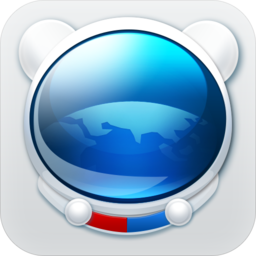
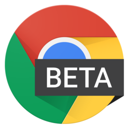
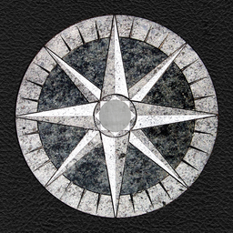
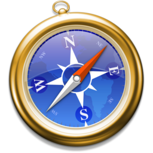

# High Resolution Browser Logos

You may want these for a presentation, a blog post or for the site
featuring your brand new awesome lightbox script (please no!). All
logos are high resolution with transparent backgrounds.

--

### 360 Secure

| [360 Secure](http://se.360.cn/) |
|:---:|
|  |

### AirWeb

| [AirWeb](http://airwebapp.com/) |
|:---:|
|  |

### Android

| [Android](https://en.wikipedia.org/wiki/Android_%28operating_system%29) | [Android WebView Beta](https://plus.google.com/+MattGaunt/posts/71X8tBLToLY) |
|:---:|:---:|
|  |  |

### Avant

| [Avant](http://www.avantbrowser.com/) |
|:---:|
|  |

### Aviator

| [Aviator](https://www.whitehatsec.com/aviator/) |
|:---:|
|  |

### Baidu

| [Baidu](http://global.baidu.com/browser/) |
|:---:|
|  |

### Boat

| [Boat](http://www.boatmob.com/mobile/product_browser_free.html) |
|:---:|
|  |

### Chrome

| [Chrome](https://www.google.com/chrome/) | [Chrome Canary](https://www.google.com/intl/en/chrome/browser/canary.html) |
|:---:|:---:|
|  |  |

### Chrome for Android

| [Chrome  (Android)](https://www.google.com/intl/en/chrome/browser/mobile/android.html) | [Chrome Beta  (Android)](https://play.google.com/store/apps/details?id=com.chrome.beta) | [Chrome Dev (Android)](https://play.google.com/store/apps/details?id=com.chrome.dev)
|:---:|:---:|:---:|
|  |  |  |

### Chromium

| [Chromium](https://www.chromium.org/Home) |
|:---:
|  |

### CM

| [CM](https://www.cmcm.com/en-us/cm-browser/) |
|:---:|
|  |

### Coast

| [Coast](http://coastbyopera.com/) |
|:---:|:---:|
|  |

### Diigo

| [Diigo](https://www.diigo.com/tools) |
|:---:|:---:|
|  |

### Docler

| [Docler](http://doclerbrowser.com/) |
|:---:|:---:|
|  |

### Dolphin

| [Dolphin](https://dolphin.com/) | [Dolphin Zero](https://dolphin.com/) |
|:---:|:---:|
|  |  |

### Dooble

| [Dooble](http://dooble.sourceforge.net/) |
|:---:|
|  |

### Edge

| [Microsoft Edge](http://blogs.msdn.com/b/ie/archive/2015/04/29/microsoft-edge-is-the-browser-for-windows-10.aspx) |
|:---:|
|  |

### Epic

| [Epic](https://www.epicbrowser.com/) |
|:---:|
|  |

### Firefox

| [Firefox](https://www.mozilla.org/en-US/firefox/) | [Firefox Beta](https://www.mozilla.org/beta/) | [Firefox Developer Edition](https://www.mozilla.org/en-US/firefox/developer/) | [Firefox Nightly](https://nightly.mozilla.org/) |
|:---:|:---:|:---:|:---:|
|  |  |  |  |

### iCab

| [iCab (Mobile)](http://www.icab.de/mobile.html) |
|:---:|
|  |

### IceCat

| [IceCat](https://www.gnu.org/software/gnuzilla/) |
|:---:|
|  |

### Iceweasel

| [Iceweasel](https://en.wikipedia.org/wiki/Mozilla_Corporation_software_rebranded_by_the_Debian_project#IceWeasel) |
|:---:|
|  |

### Internet Explorer

| Internet Explorer  [9](http://windows.microsoft.com/en-gb/internet-explorer/ie-9-worldwide-languages) / [10](http://windows.microsoft.com/en-us/internet-explorer/ie-10-worldwide-languages) / [11](http://windows.microsoft.com/en-us/internet-explorer/ie-11-worldwide-languages) | Internet Explorer  [10](http://windows.microsoft.com/en-us/internet-explorer/ie-10-worldwide-languages) / [11](http://windows.microsoft.com/en-us/internet-explorer/ie-11-worldwide-languages) tile | [Internet Explorer  Developer Channel](http://devchannel.modern.ie/) |
|:---:|:---:|:---:|
|  |  |  |

### K-Meleon

| [K-Meleon](http://kmeleon.sourceforge.net/) |
|:---:|
|  |

### Konqueror

| [Konqueror](https://www.konqueror.org/) |
|:---:|
|  |

### Lightning

| [Lightning](https://github.com/anthonycr/Lightning-Browser/) |
|:---:|
|  |

### Link Bubble

| [Link Bubble](http://www.linkbubble.com/) |
|:---:|
|  |

### Maxthon

| [Maxthon](http://www.maxthon.com/) | [Maxthon Beta](http://www.maxthon.com/) |
|:---:|:---:|
|  |  |

### Mercury

| [Mercury](https://mercury-browser.com/) |
|:---:|
|  |

### MetaCert

| [MetaCert](https://metacert.com/) |
|:---:|
|  |

### Midori

| [Midori](http://www.midori-browser.org/) |
|:---:|
|  |

### MIHTool

| [MIHTool](http://www.iunbug.com/mihtool) |
|:---:|
|  |

### NetSurf

| [NetSurf](http://www.netsurf-browser.org/) |
|:---:|
|  |

### Ninesky

| [Ninesky](https://play.google.com/store/apps/details?id=com.ninesky.browser) |
|:---:|
|  |

### OmniWeb

| [OmniWeb](https://www.omnigroup.com/more) | [OmniWeb Test Build](https://omnistaging.omnigroup.com/omniweb/) |
|:---:|:---:|
|  |  |

### Onion

| [Onion](https://mike.tig.as/onionbrowser/) |
|:---:|
|  |

### Opera

| [Opera](http://www.opera.com/) | [Opera Beta](http://www.opera.com/computer/beta) | [Opera Developer](http://www.opera.com/developer) |
|:---:|:---:|:---:|
|  |  |  |

### Opera Mini

| [Opera Mini](http://www.opera.com/mobile/mini) | [Opera Mini Beta](http://www.opera.com/mobile/mini) |
|:---:|:---:|
|  |  |

### Orbitum

| [Orbitum](https://orbitum.com/) |
|:---:|
|  |

### Pale Moon

| [Pale Moon](https://www.palemoon.org/) |
|:---:|
|  |

### Puffin

| [Puffin](https://www.puffinbrowser.com/) |
|:---:|
|  |

### QQ

| [QQ](http://browser.qq.com/) |
|:---:|
|  |

### rekonq

| [rekonq](https://rekonq.kde.org/) |
|:---:|
|  |

### Safari

| [Safari](https://www.apple.com/safari/) | [Safari (iOS)](https://www.apple.com/safari/) |
|:---:|:---:|
|  |  |

### SeaMonkey

| [SeaMonkey](http://www.seamonkey-project.org/) |
|:---:|
|  |

### Silk

| [Silk](https://amazonsilk.wordpress.com/) |
|:---:|
|  |

### Sleipnir

| [Sleipnir (Mac)](http://www.fenrir-inc.com/us/sleipnir-family/) | [Sleipnir (Mobile)](http://www.fenrir-inc.com/us/sleipnir-family/) | [Sleipnir (Windows)](http://www.fenrir-inc.com/us/sleipnir-family/) |
|:---:|:---:|:---:|
|  |  |  |

### SlimBoat

| [SlimBoat](http://www.slimboat.com/) |
|:---:|
|  |

### Sogou

| [Sogou (Mobile)](http://mse.sogou.com/) |
|:---:|
|  |

### Tor

| [Tor](https://www.torproject.org/) |
|:---:|
|  |

### Torch

| [Torch](https://www.torchbrowser.com/) |
|:---:|
|  |

### UC

| [UC](http://www.ucweb.com) |
|:---:|
|  |

### Vivaldi

| [Vivaldi](https://vivaldi.com/) |
|:---:|
|  |

### WaterFox

| [WaterFox](https://www.waterfoxproject.org/) |
|:---:|
|  |

### Web

| [Web  (f.k.a. Epiphany)](https://wiki.gnome.org/Apps/Web) |
|:---:|
|  |

### WebKit

| [WebKit](http://nightly.webkit.org/) |
|:---:|
|  |

### Yandex

| [Yandex](https://browser.yandex.com/) |
|:---:|
|  |

### Archive

For logos of browsers that are no longer active, or for older logos of the
browsers listed above, check the [archive](archive#readme) directory.

---

## Acknowledgements

[Browser Logos](https://github.com/alrra/browser-logos/)
is only possible thanks to all the awesome
[contributors](https://github.com/alrra/browser-logos/contributors)!

## Contributing

Anyone and everyone is welcome to contribute, but before you do, please take a
moment to review the [guidelines](CONTRIBUTING.md).

* [Bug reports](CONTRIBUTING.md#bugs)
* [Feature requests](CONTRIBUTING.md#features)
* [Pull requests](CONTRIBUTING.md#pull-requests)

## Getting the browser logos

There are a few options for getting the browser logos:

* Download the [zip archive](https://github.com/alrra/browser-logos/archive/10.0.2.zip)
* Install them via:
    * [npm](https://npmjs.org/): `npm install --save-dev alrra/browser-logos`
    * [Bower](http://bower.io/): `bower install --save-dev browser-logos`

## Legal

#### __All logos and trademarks are the property of their respective owners!__

If you represent the entity that has the rights over a logo and you want,
for whatever reason, that logo removed from this project, [open an
issue](https://github.com/alrra/browser-logos/issues/new) requesting its
takedown and we will remove it as soon as possible.

## Project origin and history

Read [Paul Irish](https://github.com/paulirish/)'s ["High-res Browser
Logos"](https://www.paulirish.com/2010/high-res-browser-icons/) blog post.
