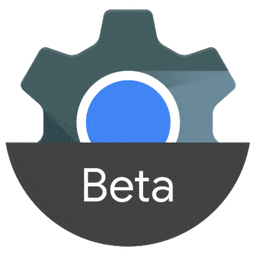

<!-- markdown-link-check-disable -->
Browser Logos [![Build Status][build icon]][build url]
=============
<!-- markdown-link-check-enable -->

<!-- markdownlint-disable line-length no-inline-html -->
<table>
    <tbody>
        <tr>
            <td height=320>
                
                
            </td>
        </tr>
    </tbody>
</table>
<!-- markdownlint-enable line-length no-inline-html -->

You may want these for a presentation, a blog post or for the site
featuring your brand new awesome lightbox script (please no!). All
logos are high resolution with transparent backgrounds.

---

Current browser logos
---------------------

For logos of browsers that are currently active, check the [`src/`][src
readme] directory.

<!-- markdownlint-disable line-length no-inline-html -->
<table>
    <tbody>
        <tr height=160>
            <td></td>
        </tr>
    </tbody>
</table>
<!-- markdownlint-enable line-length no-inline-html -->

Old browser logos
-----------------

For older logos, or logos of browsers that are no longer active, check
the [`src/archive/`][archive readme] directory.

<!-- markdownlint-disable line-length no-inline-html -->
<table>
    <tbody>
        <tr height=160>
            <td></td>
        </tr>
    </tbody>
</table>
<!-- markdownlint-enable line-length no-inline-html -->

---

Getting the browser logos
-------------------------

There are a few options for getting the browser logos:

### 1) Get individual logos

* Install using:

  * [`npm`][npm]: `npm install --save-dev @browser-logos/`[`<logo>`][packages]
  * [`Yarn`][yarn]: `yarn add --dev @browser-logos/`[`<logo>`][packages]

* Use [`cdnjs`][cdnjs].

### 2) Get all logos

* Download the [`zip` archive][archive].
* Use [`cdnjs`][cdnjs].

Contributing
------------

Anyone and everyone is welcome to contribute, but before you do, please
take a moment to review the [guidelines](.github/CONTRIBUTING.md).

* [Bug reports](.github/CONTRIBUTING.md#bugs)
* [Feature requests](.github/CONTRIBUTING.md#features)
* [Pull requests](.github/CONTRIBUTING.md#pull-requests)

Acknowledgements
----------------

[Browser Logos][repo] is only possible thanks to all the awesome
[contributors][contributors]!

Legal
-----

All logos and trademarks are the property of their respective owners.

Everything else is available under the [MIT license][license].

Project origin and history
--------------------------

Read [Paul Irish][github paul]'s [_"High-res Browser Logos"_][article
paul] blog post.

<!-- Link labels: -->

[archive readme]: src/archive/README.md#readme
[archive]: https://github.com/alrra/browser-logos/archive/74.1.0.zip
[article paul]: https://www.paulirish.com/2010/high-res-browser-icons/
[build icon]: https://github.com/alrra/browser-logos/actions/workflows/test.yml/badge.svg
[build url]: https://github.com/alrra/browser-logos/actions/workflows/test.yml
[cdnjs]: https://cdnjs.com/libraries/browser-logos
[contributors]: https://github.com/alrra/browser-logos/graphs/contributors
[github paul]: https://github.com/paulirish/
[license]: LICENSE.txt
[npm]: https://www.npmjs.com/
[packages]: https://www.npmjs.com/org/browser-logos
[repo]: https://github.com/alrra/browser-logos/
[src readme]: src/README.md#readme
[yarn]: https://yarnpkg.com/
