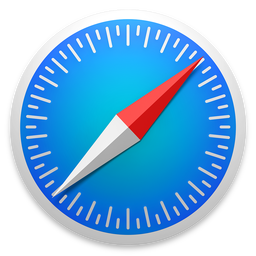

# High Resolution Browser Logos

You may want these for a presentation, a blog post or for the site
featuring your brand new awesome lightbox script (please no!). All
logos are high resolution with transparent backgrounds.

--

### 360 Secure

| [360 Secure](http://se.360.cn/) |
|:---:|
|  |

### Adrenaline

| [Adrenaline](https://www.adrenalinemobility.com/) |
|:---:|
|  |

### AirWeb

| [AirWeb](http://airwebapp.com/) |
|:---:|
|  |

### AllInOne

| [AllInOne](http://www.allinonebrowser.com/) |
|:---:|
|  |

### Avant

| [Avant](http://www.avantbrowser.com/) |
|:---:|
|  |

### Aviator

| [Aviator](https://www.whitehatsec.com/aviator/) |
|:---:|
|  |

### Baidu

| [Baidu](http://global.baidu.com/browser/) |
|:---:|
|  |

### Boat

| [Boat](http://www.boatmob.com/mobile/product_browser_free.html) |
|:---:|
|  |

### Cheetah

| [Cheetah](http://www.liebao.cn/) |
|:---:|
|  |

### Chrome

| [Chrome](https://www.google.com/chrome/) | [Chrome  (Android)](https://www.google.com/intl/en/chrome/browser/mobile/android.html) | [Chrome Beta  (Android)](https://www.google.com/intl/en/chrome/browser/mobile/android.html) | [Chrome Canary](https://www.google.com/intl/en/chrome/browser/canary.html) |
|:---:|:---:|:---:|:---:|
|  |  |  |  |

### Chromium

| [Chromium](https://www.chromium.org/Home) |
|:---:
|  |

### Coast

| [Coast](http://coastbyopera.com/) |
|:---:|:---:|
|  |

### Diigo

| [Diigo](https://www.diigo.com/tools) |
|:---:|:---:|
|  |

### Docler

| [Docler](http://doclerbrowser.com/) |
|:---:|:---:|
|  |

### Dolphin

| [Dolphin](http://dolphin.com/) | [Dolphin Zero](http://dolphin.com/) |
|:---:|:---:|
|  |  |

### Dooble

| [Dooble](http://dooble.sourceforge.net/) |
|:---:|
|  |

### Epic

| [Epic](https://www.epicbrowser.com/) |
|:---:|
|  |

### Exsoul

| [Exsoul](http://www.exsoul-browser.com/) |
|:---:|
|  |

### Firefox

| [Firefox](https://www.mozilla.org/en-US/firefox/) | [Firefox Beta](https://www.mozilla.org/beta/) | [Firefox Developer Edition](https://www.mozilla.org/en-US/firefox/developer/) | [Firefox Nightly](https://nightly.mozilla.org/) |
|:---:|:---:|:---:|:---:|
|  |  |  |  |

### iCab

| [iCab (Mobile)](http://www.icab.de/mobile.html) |
|:---:|
|  |

### IceCat

| [IceCat](https://www.gnu.org/software/gnuzilla/) |
|:---:|
|  |

### Iceweasel

| [Iceweasel](https://packages.debian.org/wheezy/iceweasel) |
|:---:|
|  |

### Internet Explorer

| Internet Explorer  [9](http://windows.microsoft.com/en-gb/internet-explorer/ie-9-worldwide-languages) / [10](http://windows.microsoft.com/en-us/internet-explorer/ie-10-worldwide-languages) / [11](http://windows.microsoft.com/en-us/internet-explorer/ie-11-worldwide-languages) | Internet Explorer  [10](http://windows.microsoft.com/en-us/internet-explorer/ie-10-worldwide-languages) / [11](http://windows.microsoft.com/en-us/internet-explorer/ie-11-worldwide-languages) tile | [Internet Explorer  Developer Channel](http://devchannel.modern.ie/) |
|:---:|:---:|:---:|
|  |  |  |

### Konqueror

| [Konqueror](https://www.konqueror.org/) |
|:---:|
|  |

### Lightning

| [Lightning](https://github.com/anthonycr/Lightning-Browser/) |
|:---:|
|  |

### Link Bubble

| [Link Bubble](http://www.linkbubble.com/) |
|:---:|
|  |

### Lunascape

| [iLunascape  (Android)](http://www.lunascape.tv/) | [iLunascape  (iOS)](http://www.lunascape.tv/) |
|:---:|:---:|
|  |  |

### Maxthon

| [Maxthon](http://www.maxthon.com/) | [Maxthon Beta](http://www.maxthon.com/) |
|:---:|:---:|
|  |  |

### Mercury

| [Mercury](https://mercury-browser.com/) |
|:---:|
|  |

### MetaCert

| [MetaCert](https://metacert.com/) |
|:---:|
|  |

### Midori

| [Midori](http://www.midori-browser.org/) |
|:---:|
|  |

### MIHTool

| [MIHTool](http://www.iunbug.com/mihtool) |
|:---:|
|  |

### Mobicip

| [Mobicip](https://www.mobicip.com/products) |
|:---:|
|  |

### NetSurf

| [NetSurf](http://www.netsurf-browser.org/) |
|:---:|
|  |

### Next

| [Next](http://nextbrowser.goforandroid.com/) |
|:---:|
|  |

### Ninesky

| [Ninesky](https://play.google.com/store/apps/details?id=com.ninesky.browser) |
|:---:|
|  |

### OmniWeb

| [OmniWeb](https://www.omnigroup.com/more) |
|:---:|
|  |

### Onion

| [Onion](https://mike.tig.as/onionbrowser/) |
|:---:|
|  |

### Opera

| [Opera](http://www.opera.com/) | [Opera Next](http://www.opera.com/next/) | [Opera Developer](http://www.opera.com/developer) |
|:---:|:---:|:---:|
|  |  |  |

### Orweb

| [Orweb](https://guardianproject.info/apps/orweb/) |
|:---:|
|  |

### Pale Moon

| [Pale Moon](http://www.palemoon.org/) |
|:---:|
|  |

### Photon

| [Photon](http://www.appsverse.com/) |
|:---:|
|  |

### Puffin

| [Puffin](https://www.puffinbrowser.com/) |
|:---:|
|  |

### QQ

| [QQ](http://browser.qq.com/) |
|:---:|
|  |

### rekonq

| [rekonq](https://rekonq.kde.org/) |
|:---:|
|  |

### Safari

| [Safari](https://www.apple.com/safari/) | [Safari (iOS)](https://www.apple.com/safari/) |
|:---:|:---:|
|  |  |

### SeaMonkey

| [SeaMonkey](http://www.seamonkey-project.org/) |
|:---:|
|  |

### Sleipnir

| [Sleipnir (Android)](http://www.fenrir-inc.com/us/android/apps/sleipnir-mobile.html) | [Sleipnir (iOS)](http://www.fenrir-inc.com/us/iphone/apps/sleipnir-mobile.html) | [Sleipnir (Mac)](http://www.fenrir-inc.com/us/sleipnir-family/) | [Sleipnir (Windows)](http://www.fenrir-inc.com/us/sleipnir-family/) |
|:---:|:---:|:---:|:---:|
|  |  |  | 

### SlimBoat

| [SlimBoat](http://www.slimboat.com/) |
|:---:|
|  |

### Sogou

| [Sogou (Mobile)](http://mse.sogou.com/) |
|:---:|
|  |

### Tor

| [Tor](https://www.torproject.org/) |
|:---:|
|  |

### Torch

| [Torch](https://www.torchbrowser.com/) |
|:---:|
|  |

### UC

| [UC](http://www.ucweb.com) |
|:---:|
|  |

### Web

| [Web  (f.k.a. Epiphany)](https://wiki.gnome.org/Apps/Web) |
|:---:|
|  |

### WebKit

| [WebKit](http://nightly.webkit.org/) |
|:---:|
|  |

### Yandex

| [Yandex](https://browser.yandex.com/) | [Yandex Alpha](https://browser.yandex.com/future/) |
|:---:|:---:|
|  |  |

### Archive

For logos of browsers that are no longer active, or for older logos of the
browsers listed above, check the [archive](archive) directory.

### Browser Ponies

| Chrome | Firefox | Internet Explorer | Opera | Safari |
|:---:|:---:|:---:|:---:|:---:|
|  |  |  |  |  |

[See more browser ponies!](https://paulirish.deviantart.com/favourites/51528712)

---

## Acknowledgements

[Browser Logos](https://github.com/alrra/browser-logos/)
is only possible thanks to all the awesome
[contributors](https://github.com/alrra/browser-logos/contributors)!

## Contributing

Anyone and everyone is welcome to contribute, but before you do, please take a
moment to review the [guidelines](CONTRIBUTING.md).

* [Bug reports](CONTRIBUTING.md#bugs)
* [Feature requests](CONTRIBUTING.md#features)
* [Pull requests](CONTRIBUTING.md#pull-requests)

## Getting the browser logos

There are a few options for getting the browser logos:

* Download the [zip archive](https://github.com/alrra/browser-logos/archive/3.1.3.zip)
* Install them via:
    * [npm](https://npmjs.org/): `npm install --save-dev alrra/browser-logos`
    * [Bower](http://bower.io/): `bower install --save-dev browser-logos`

## Legal

#### __All logos and trademarks are the property of their respective owners!__

If you represent the entity that has the rights over a logo and you want,
for whatever reason, that logo removed from this project, [open an
issue](https://github.com/alrra/browser-logos/issues/new) requesting its
takedown and we will remove it as soon as possible.

## Project origin and history

Read [Paul Irish](https://github.com/paulirish/)'s ["High-res Browser
Logos"](http://www.paulirish.com/2010/high-res-browser-icons/) blog post.
