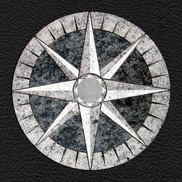

# High Resolution Browser Logos

You may want these for a presentation, a blog post or for the site
featuring your brand new awesome lightbox script (please no!). All
logos are high resolution with transparent backgrounds.

All logos and trademarks are the property of their respective owners.

### 360 Secure

| [360 Secure](http://se.360.cn/) |
|:---:|
|  |

### Adrenaline

| [Adrenaline](http://adrenalinemobility.com/) |
|:---:|
|  |

### AllInOne

| [AllInOne](http://www.allinonebrowser.com/) |
|:---:|
|  |

### Apollo

| [Apollo](http://apollobrowser.wordpress.com/the-most-innovative-browser-for-ipad/) |
|:---:|
|  |

### Atomic

| [Atomic](http://atomicwebbrowser.com/) |
|:---:|
|  |

### Avant

| [Avant](http://www.avantbrowser.com/) |
|:---:|
|  |

### Baidu

| [Baidu](http://imobile.baidu.com/browser/) |
|:---:|
|  |

### Boat

| [Boat](http://www.boatmob.com/) | [Boat Mini](http://www.boatmob.com/) |
|:---:|:---:|
|  |  |

### Cheetah

| [Cheetah](http://www.liebao.cn/) |
|:---:|
|  |

### Chrome

| [Chrome](https://www.google.com/chrome/) | [Chrome (Android)](http://www.google.com/intl/en/chrome/browser/mobile/android.html) | [Chrome Beta (Android)](http://www.google.com/intl/en/chrome/browser/mobile/android.html) | [Chrome Canary](https://www.google.com/intl/en/chrome/browser/canary.html) |
|:---:|:---:|:---:|:---:|
|  |  |  |  |

### Chromium

| [Chromium](http://www.chromium.org/Home) |
|:---:
|  |

### Coast

| [Coast](http://coastbyopera.com/) |
|:---:|:---:|
|  |

### Cruz

| [Cruz](http://cruzapp.com/) |
|:---:|:---:|
|  |

### CXM Web

| [CXM Web](https://itunes.apple.com/us/app/cxm-web-by-citrix/id666516824) |
|:---:|:---:|
|  |

### Diigo

| [Diigo](https://www.diigo.com/tools) |
|:---:|:---:|
|  |

### Docler

| [Docler](http://doclerbrowser.com/) |
|:---:|:---:|
|  |

### Dolphin

| [Dolphin](http://dolphin.com/) | [Dolphin Beta](http://dolphin.com/beta/) |
|:---:|:---:|
|  |  |

### Dooble

| [Dooble](http://dooble.sourceforge.net/) |
|:---:|
|  |

### Exsoul

| [Exsoul](http://www.exsoul-browser.com/) |
|:---:|
|  |

### Firefox

| [Firefox](http://www.mozilla.org/en-US/firefox/) | [Firefox Beta](http://www.mozilla.org/beta/) | [Firefox Aurora](http://www.mozilla.org/en-US/firefox/aurora/) | [Firefox Nightly](http://nightly.mozilla.org/) |
|:---:|:---:|:---:|:---:|
|  |  |  |  |

### iCab

| [iCab Mobile](http://www.icab.de/mobile.html) |
|:---:|
|  |

### Internet Explorer

| [Internet Explorer 6](http://www.microsoft.com/en-us/download/details.aspx?id=1)  | [Internet Explorer 7](http://www.microsoft.com/en-us/download/internet-explorer-7-details.aspx) / [8](http://www.microsoft.com/en-us/download/internet-explorer-8-details.aspx) | [Internet Explorer 9](http://windows.microsoft.com/en-gb/internet-explorer/ie-9-worldwide-languages) / [10](http://windows.microsoft.com/en-us/internet-explorer/ie-10-worldwide-languages) | [Internet Explorer 10](http://windows.microsoft.com/en-us/internet-explorer/ie-10-worldwide-languages) |
|:---:|:---:|:---:|:---:|
|  |  |  |  |

### iSwifter

| [iSwifter](http://iswifter.net/) |
|:---:|
|  |

### K9

| [K9](http://www1.k9webprotection.com/) |
|:---:|
|  |

### KidZui

| [KidZui](http://www.kidzui.com/) |
|:---:|
|  |

### Konqueror

| [Konqueror](http://www.konqueror.org/) |
|:---:|
|  |

### Kylo

| [Kylo](http://kylo.tv/) |
|:---:|
|  |

### Lightning

| [Lightning](https://github.com/anthonycr/Lightning-Browser/) |
|:---:|
|  |

### Lunascape

| [iLunascape (Android)](http://www.lunascape.tv/) | [iLunascape (iOS)](http://www.lunascape.tv/) |[iLunascape Lite (iOS)](http://www.lunascape.tv/) |
|:---:|:---:|:---:|
|  |  |  |

### Maven

| [Maven](http://www.creamycheesy.com/maven/) |
|:---:|
|  |

### Maxthon

| [Maxthon](http://www.maxthon.com/) | [Maxthon Beta](http://www.maxthon.com/) |
|:---:|:---:|
|  |  |

### Mercury

| [Mercury](http://mercury-browser.com/) |
|:---:|
|  |

### MetaCert

| [MetaCert](https://metacert.com/) |
|:---:|
|  |

### Midori

| [Midori](http://www.midori-browser.org/) |
|:---:|
|  |

### MIHTool

| [MIHTool](http://www.iunbug.com/mihtool) |
|:---:|
|  |

### Mobicip

| [Mobicip](http://www.mobicip.com/products) |
|:---:|
|  |

### NetSurf

| [NetSurf](http://www.netsurf-browser.org/) |
|:---:|
|  |

### Next

| [Next](http://nextbrowser.goforandroid.com/) |
|:---:|
|  |

### Ninesky

| [Ninesky](http://www.ninesky.com/) |
|:---:|
|  |

### NLIA

| [NLIA](http://e.netpia.com/) |
|:---:|
|  |

### Ocean

| [Ocean](http://www.compal.com/apps/oceanbrowser/) |
|:---:|
|  |

### Omega

| [Omega](http://ddmsite.ucoz.ru/) |
|:---:|
|  |

### OmniWeb

| [OmniWeb](http://www.omnigroup.com/products/omniweb/) |
|:---:|
|  |

### ONE

| [ONE (Android)](http://one-browser.com/mobile/home) | [ONE (iPhone)](http://one-browser.com/mobile/home) |
|:---:|:---:|
|  |  |

### Onion

| [Onion](https://mike.tig.as/onionbrowser/) |
|:---:|
|  |

### Opera

| [Opera](http://www.opera.com/) | [Opera Next](http://www.opera.com/next/) | [Opera Developer](http://www.opera.com/developer) |
|:---:|:---:|:---:|
|  |  |  |

### Orweb

| [Orweb](https://guardianproject.info/apps/orweb/) |
|:---:|
|  |

### Perfect

| [Perfect](http://www.perfectbrowser.com/) |
|:---:|
|  |

### Puffin

| [Puffin](http://www.puffinbrowser.com/) |
|:---:|
|  |

### QQ

| [QQ](http://mb.qq.com/) |
|:---:|
|  |

### rekonq

| [rekonq](http://rekonq.kde.org/) |
|:---:|
|  |

### Safari

| [Safari](http://www.apple.com/safari/) | [Safari (iOS 6)](http://www.apple.com/safari/) |
|:---:|:---:|
|  |  |

### SeaMonkey

| [SeaMonkey](http://www.seamonkey-project.org/) |
|:---:|
|  |

### Seyyah

| [Seyyah](http://seyyah.mozkan.com/) |
|:---:|
|  |

### Silk

| [Silk](http://www.amazon.com/silk) |
|:---:|
|  |

### Skyfire

| [Skyfire (Android)](http://www.skyfire.com/) | [Skyfire (iPhone)](http://www.skyfire.com/) | [Skyfire (iPad)](http://www.skyfire.com/) |
|:---:|:---:|:---:|
|  |  |  |

### Sleipnir

| [Sleipnir (Mac)](http://www.fenrir-inc.com/us/sleipnir-family/) | [Sleipnir (Mobile)](http://www.fenrir-inc.com/us/sleipnir-family/) |
|:---:|:---:|
|  |  |

### SlimBoat

| [SlimBoat](http://www.slimboat.com/) |
|:---:|
|  |

### Spearmint

| [Spearmint](http://www.spearmintbrowser.com/) |
|:---:|
|  |

### Stainless

| [Stainless](http://www.stainlessapp.com/) |
|:---:|
|  |

### Super Fast

| [Super Fast](http://www.sfbrowser.com/) |
|:---:|
|  |

### Terra

| [Terra](http://readdle.com/products/terra/) |
|:---:|
|  |

### Tor

| [Tor](https://www.torproject.org/) |
|:---:|
|  |

### Torch

| [Torch](http://www.torchbrowser.com/) |
|:---:|
|  |

### Touch

| [Touch](http://www.windowsphone.com/en-us/store/app/touch-browser/c2c6b395-d724-4426-867a-36684eeca0b2) |
|:---:|
|  |

### UC

| [UC](http://www.ucweb.com) | [UC (iPhone)](http://www.ucweb.com) |
|:---:|:---:|
|  |  |

### Vitrum

| [Vitrum](http://capablebits.com/) |
|:---:|
|  |

### WebKit

| [WebKit](http://nightly.webkit.org/) |
|:---:|
|  |

### Wyzo

| [Wyzo](http://www.wyzo.com/) |
|:---:|
|  |

### Yandex

| [Yandex](http://browser.yandex.com/) |
|:---:|
|  |

## Browser Ponies

| Chrome | Firefox | Internet Explorer | Opera | Safari |
|:---:|:---:|:---:|:---:|:---:|
|  |  |  |  |  |

[See more browser ponies!](http://paulirish.deviantart.com/favourites/51528712)

## Acknowledgements

[Browser Logos](https://github.com/paulirish/browser-logos/)
is only possible thanks to all the awesome
[contributors](https://github.com/paulirish/browser-logos/contributors)!

This project is currently maintained by:

|  |
|:---:|
| [Cătălin Mariș](http://twitter.com/alrra) |
