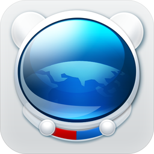
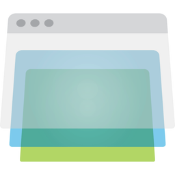
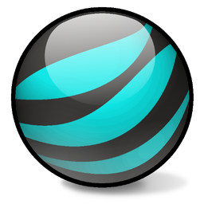
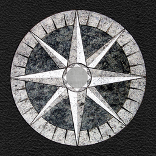

### Adrenaline

| [Adrenaline](https://web.archive.org/web/20141218215235/http://www.adrenalinemobility.com/) |
|:---:|
|  |

### AllInOne

| [AllInOne](https://web.archive.org/web/20150801011234/http://allinonebrowser.com/) |
|:---:|
|  |

### Apollo

| [Apollo](https://web.archive.org/web/20141006164535/http://apollobrowser.wordpress.com/the-most-innovative-browser-for-ipad/) |
|:---:|
|  |

### Arora

| [Arora](https://en.wikipedia.org/wiki/Arora_%28web_browser%29) |
|:---:|
|  |

### Atomic

| [Atomic](https://web.archive.org/web/20150801050429/http://atomicwebbrowser.com/) |
|:---:|
|  |

### Axis

| [Axis](https://en.wikipedia.org/wiki/Yahoo!_Axis) |
|:---:|
|  |

### Baidu

| [Baidu (Mobile)](https://web.archive.org/web/20150726085553/http://global.baidu.com/browser/) [`1*`](#note)| [Baidu (Mobile)](https://web.archive.org/web/20150726085553/http://global.baidu.com/browser/) [`2*`](#note) |
|:---:|:---:|
|  |  |

### Breach

| [Breach](https://github.com/breach) [`*`](#note) |
|:---:|
|  |

### Camino

| [Camino](https://en.wikipedia.org/wiki/Camino) |
|:---:|
|  |

### Cheetah

| [Cheetah](https://en.wikipedia.org/wiki/Cheetah_Mobile) |
|:---:|
|  |

### Chrome

| [Chrome 1-10](https://en.wikipedia.org/wiki/Google_Chrome) |
|:---:|
|  |

### Chrome (Android)

| [Chrome 25-36 (Android)](https://en.wikipedia.org/wiki/Google_Chrome_for_Android) |
|:---:|
|  |

### Chrome Beta (Android)

| [Chrome Beta 25-36 (Android)](https://en.wikipedia.org/wiki/Google_Chrome_for_Android) |
|:---:|
|  |

### Chromium

| [Chromium 1-10](https://en.wikipedia.org/wiki/Chromium_%28web_browser%29) |
|:---:|
|  |

### Cruz

| [Cruz](https://en.wikipedia.org/wiki/Fluid_%28web_browser%29) |
|:---:|:---:|
|  |

### CXM Web

| [CXM Web](https://itunes.apple.com/us/app/cxm-web-by-citrix/id666516824) [`*`](#note) |
|:---:|:---:|
|  |

### Diigo

| [Diigo](https://en.wikipedia.org/wiki/Diigo) [`1*`](#note) | [Diigo](https://en.wikipedia.org/wiki/Diigo) [`2*`](#note) |
|:---:|:---:|
|  |  |

### Docler

| [Docler](https://web.archive.org/web/20150801111856/http://doclerbrowser.com/) [`*`](#note)  |
|:---:|:---:|
|  |

### Dolphin

| [Dolphin](https://en.wikipedia.org/wiki/Dolphin_Browser) [`1*`](#note) | [Dolphin](https://en.wikipedia.org/wiki/Dolphin_Browser) [`2*`](#note) |
|:---:|:---:|
|  |  |

### Dolphin Beta

| [Dolphin Beta](https://en.wikipedia.org/wiki/Dolphin_Browser) |
|:---:|
|  |

### Dolphin Zero

| [Dolphin Zero](https://en.wikipedia.org/wiki/Dolphin_Browser) |
|:---:|
|  |

### Epic

| [Epic](https://en.wikipedia.org/wiki/Epic_%28web_browser%29) [`*`](#note) |
|:---:|
|  |

### Epiphany

| [Epiphany](https://en.wikipedia.org/wiki/Web_%28web_browser%29) |
|:---:|
|  |

### Exsoul

| [Exsoul](https://web.archive.org/web/20150803013210/http://www.exsoul-browser.com/) [`1*`](#note) | [Exsoul](https://web.archive.org/web/20150803013210/http://www.exsoul-browser.com/) [`2*`](#note) |
|:---:|:---:|
|  |  |

### Fake

| [Fake](https://web.archive.org/web/20150801071338/http://fakeapp.com/) |
|:---:|
|  |

### Fennec

| [Fennec](https://en.wikipedia.org/wiki/Firefox_for_mobile) |
|:---:|
|  |

### Firefox

| [Phoenix /   Firebird](https://en.wikipedia.org/wiki/Firefox#History) | [Firefox 1](https://en.wikipedia.org/wiki/Firefox) | [Firefox 1.5-3](https://en.wikipedia.org/wiki/Firefox) | [Firefox 3.5-22](https://en.wikipedia.org/wiki/Firefox) |
|:---:|:---:|:---:|:---:|
|  |  |  |  |

### Firefox Aurora

| [Firefox Aurora 5-22](https://en.wikipedia.org/wiki/Firefox#Versions) | [Firefox Aurora 23-35](https://en.wikipedia.org/wiki/Firefox#Versions) |
|:---:|:---:|
|  |  |

### Firefox Nightly

| [Firefox Nightly 6-22](https://en.wikipedia.org/wiki/Firefox#Versions) |
|:---:|
|  |

### Flock

| [Flock](https://en.wikipedia.org/wiki/Flock_%28web_browser%29) |
|:---:|
|  |

### iCab

| [iCab Mobile](https://en.wikipedia.org/wiki/ICab) [`*`](#note) |
|:---:|
|  |

### Iceape

| [Iceape](https://en.wikipedia.org/wiki/Mozilla_Corporation_software_rebranded_by_the_Debian_project#Iceape) |
|:---:|
|  |

### iLunascape

| [iLunascape  (Android)](https://en.wikipedia.org/wiki/Lunascape) [`*`](#note) | [iLunascape  (iOS)](https://en.wikipedia.org/wiki/Lunascape) [`*`](#note) |
|:---:|:---:|
|  |  |

### Internet Explorer

| [Internet Explorer 6](https://en.wikipedia.org/wiki/Internet_Explorer_6) | [Internet Explorer 7](https://en.wikipedia.org/wiki/Internet_Explorer_7)/[8](https://en.wikipedia.org/wiki/Internet_Explorer_8) |
|:---:|:---:|
|  |  |

### K9

| [K9](https://en.wikipedia.org/wiki/K9_Web_Protection) |
|:---:|
|  |

### KidZui

| [KidZui](https://en.wikipedia.org/wiki/KidZui) |
|:---:|
|  |

### Konqueror

| [Konqueror 1-3](https://en.wikipedia.org/wiki/Konqueror) |
|:---:|
|  |

### Kylo

| [Kylo](https://en.wikipedia.org/wiki/Kylo_%28web_browser%29) |
|:---:|
|  |

### Lightning

| [Lightning](https://github.com/anthonycr/Lightning-Browser/) [`*`](#note) |
|:---:|
|  |

### Link Bubble

| [Link Bubble 1-1.4](https://web.archive.org/web/20150320102407/http://www.linkbubble.com/) |
|:---:|
|  |

### Mercury

| [Mercury](https://en.wikipedia.org/wiki/Mercury_Browser) [`*`](#note) |
|:---:|
|  |

### MetaCert

| [MetaCert](https://web.archive.org/web/20150624200845/https://metacert.com/) [`*`](#note) |
|:---:|
|  |

### Mobicip

| [Mobicip](https://en.wikipedia.org/wiki/Mobicip) [`1*`](#note) | [Mobicip](https://en.wikipedia.org/wiki/Mobicip) [`2*`](#note) |
|:---:|:---:|
|  |  |

### Mosaic

| [Mosaic](https://en.wikipedia.org/wiki/Mosaic_%28web_browser%29) |
|:---:|
|  |

### Netscape

| [Netscape 4-6](https://en.wikipedia.org/wiki/Netscape_%28web_browser%29) | [Netscape 8](https://en.wikipedia.org/wiki/Netscape_Browser) | [Netscape 9](https://en.wikipedia.org/wiki/Netscape_Navigator_9) |
|:---:|:---:|:---:|
|  |  |  |

### Next

| [Next](https://web.archive.org/web/20141116131240/http://nextbrowser.goforandroid.com/) |
|:---:|
|  |

### Ninesky

| [Ninesky](https://web.archive.org/web/20140102181923/http://ninesky.com/) [`*`](#note)  |
|:---:|
|  |

### NLIA

| [NLIA](https://web.archive.org/web/20150411053800/http://e.netpia.com/) |
|:---:|
|  |

### ONE

| [ONE (Android)](https://web.archive.org/web/20140406142259/http://one-browser.com/mobile/home/) [`*`](#note) | [ONE (iOS)](https://web.archive.org/web/20140406142259/http://one-browser.com/mobile/home/) [`*`](#note) |
|:---:|:---:|
|  |  |

### Onion

| [Onion](https://github.com/OnionBrowser/iOS-OnionBrowser) [`*`](#note) |
|:---:|
|  |

### Opera

| [Opera 2-6](https://en.wikipedia.org/wiki/Opera_%28web_browser%29) | [Opera 7-9](https://en.wikipedia.org/wiki/Opera_%28web_browser%29) | [Opera 10-14](https://en.wikipedia.org/wiki/Opera_%28web_browser%29) |
|:---:|:---:|:---:|
|  |  |  |

### Opera Mini

| [Opera Mini](https://en.wikipedia.org/wiki/Opera_Mini) [`*`](#note) |
|:---:|
|  |

### Opera Next

| [Opera Next 15](https://en.wikipedia.org/wiki/Opera_%28web_browser%29#Opera_Developer_and_Opera_Next) |
|:---:|
|  |

### Orweb

| [Orweb](https://web.archive.org/web/20150802023241/https://guardianproject.info/apps/orweb/) |
|:---:|
|  |

### Photon

| [Photon](https://web.archive.org/web/20150629011134/http://www.appsverse.com/Index) |
|:---:|
|  |

### QQ

| [QQ](https://web.archive.org/web/*/http://browser.qq.com/) [`*`](#note) |
|:---:|
|  |

### Rockmelt

| [Rockmelt](https://en.wikipedia.org/wiki/Rockmelt) | [Rockmelt (iOS)](https://en.wikipedia.org/wiki/Rockmelt) |
|:---:|:---:|
|  |  |

### Safari

| [Safari 1-7](https://en.wikipedia.org/wiki/Safari_%28web_browser%29) |
|:---:|
|  |

### Safari (iOS)

| [Safari 1-6 (iOS)](https://en.wikipedia.org/wiki/Safari_%28web_browser%29) |
|:---:|
|  |

### Shiira

| [Shiira](https://en.wikipedia.org/wiki/Shiira) |
|:---:|
|  |

### Silk

| [Silk](https://en.wikipedia.org/wiki/Amazon_Silk) [`*`](#note) |
|:---:|
|  |

### Skyfire

| [Skyfire (Android)](https://en.wikipedia.org/wiki/Skyfire_%28company%29#Skyfire_Web_Browser) [`*`](#note) | [Skyfire (iOS)](https://en.wikipedia.org/wiki/Skyfire_%28company%29#Skyfire_Web_Browser) [`*`](#note) |
|:---:|:---:|
|  |  |

### Sleipnir

| [Sleipnir (Mobile)](https://en.wikipedia.org/wiki/Sleipnir_%28web_browser%29) [`*`](#note) |
|:---:|
|  |
 
### SlimBoat

| [SlimBoat](https://en.wikipedia.org/wiki/SlimBrowser) |
|:---:|
|  |

### Sogou

| [Sogou (Mobile)](https://en.wikipedia.org/wiki/Sogou#Sogou_browser) [`1*`](#note) | [Sogou (Mobile)](https://en.wikipedia.org/wiki/Sogou#Sogou_browser) [`2*`](#note) |
|:---:|:---:|
|  |  |

### Stainless

| [Stainless](https://github.com/mesadynamics/stainless) |
|:---:|
|  |

### Super Fast

| [Super Fast](https://web.archive.org/web/20150423215607/http://www.sfbrowser.com/) |
|:---:|
|  |

### surf

| [surf](https://en.wikipedia.org/wiki/Surf_%28web_browser%29) |
|:---:|
|  |

### Swiftfox

| [Swiftfox](https://en.wikipedia.org/wiki/Swiftfox) |
|:---:|
|  |

### UC

| [UC](https://en.wikipedia.org/wiki/UC_Browser) [`*`](#note) |
|:---:|
|  |

### Uzbl

| [Uzbl](https://en.wikipedia.org/wiki/Uzbl) |
|:---:|
|  |

### Vitrum

| [Vitrum](https://web.archive.org/web/20140928181625/https://itunes.apple.com/us/app/vitrum-unique-web-browser/id569847799?mt=8) |
|:---:|
|  |

### WaterFox

| [WaterFox](https://en.wikipedia.org/wiki/Waterfox) [`*`](#note) |
|:---:|
|  |

### WebKit

| [Webkit Nightly 1-7](https://en.wikipedia.org/wiki/WebKit) |
|:---:|
|  |

### Wyzo

| [Wyzo](https://en.wikipedia.org/wiki/Wyzo) |
|:---:|
|  |

### Xpress

| [Xpress](https://en.wikipedia.org/wiki/Nokia_Xpress) [`*`](#note) |
|:---:|
|  |

### Xtravo

| [Xtravo](https://github.com/sheikhimran01/xtravo) |
|:---:|
|  |

### Yandex

| [Yandex](https://en.wikipedia.org/wiki/Yandex_Browser) [`*`](#note) |
|:---:|
|  |

--

### Note:

__`*`__ indicates that the exact browser version is unknown.
