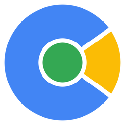
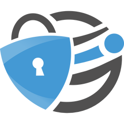
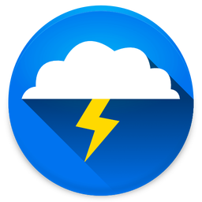
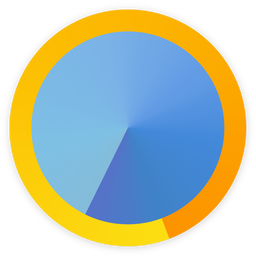
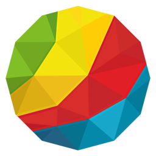
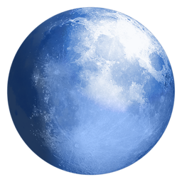

### Adblock

<table>
    <thead>
        <tr>
            <th><a href="https://adblockbrowser.org/">Adblock</a></th>
        </tr>
    </thead>
    <tbody>
        <tr height=160>
            <td></td>
        </tr>
    </tbody>
</table>

### Android

<table>
    <thead>
        <tr>
            <th><a href="https://en.wikipedia.org/wiki/Android_%28operating_system%29">Android Browser</a></th>
            <th><a href="https://plus.google.com/+MattGaunt/posts/71X8tBLToLY">Android WebView Beta</a></th>
        </tr>
    </thead>
    <tbody>
        <tr height=160>
            <td></td>
            <td></td>
        </tr>
    </tbody>
</table>

### Avant

<table>
    <thead>
        <tr>
            <th><a href="http://www.avantbrowser.com/">Avant</a></th>
        </tr>
    </thead>
    <tbody>
        <tr height=160>
            <td></td>
        </tr>
    </tbody>
</table>

### Blisk

<table>
    <thead>
        <tr>
            <th><a href="https://blisk.io/">Blisk</a></th>
        </tr>
    </thead>
    <tbody>
        <tr height=160>
            <td></td>
        </tr>
    </tbody>
</table>

### Boat

<table>
    <thead>
        <tr>
            <th><a href="http://www.boatmob.com/mobile/product_browser_free.html">Boat</a></th>
        </tr>
    </thead>
    <tbody>
        <tr height=160>
            <td></td>
        </tr>
    </tbody>
</table>

### Brave

<table>
    <thead>
        <tr>
            <th><a href="https://www.brave.com/">Brave</a></th>
        </tr>
    </thead>
    <tbody>
        <tr height=160>
            <td></td>
        </tr>
    </tbody>
</table>

### Browser.html

<table>
    <thead>
        <tr>
            <th><a href="https://github.com/browserhtml/browserhtml#readme">Browser.html</a></th>
        </tr>
    </thead>
    <tbody>
        <tr height=160>
            <td></td>
        </tr>
    </tbody>
</table>

#### Cent

<table>
    <thead>
        <tr>
            <th><a href="https://www.centbrowser.com">Cent</a></th>
        <tr>
    </thead>
    <tbody>
        <tr height=160>
            <td></td>
        <tr>
    </tbody>
</table>

### Chrome

<table>
    <thead>
        <tr>
            <th><a href="https://www.google.com/chrome/">Chrome</a></th>
            <th><a href="https://www.google.com/chrome/browser/beta.html">Chrome Beta</a></th>
            <th><a href="https://www.chromium.org/getting-involved/dev-channel">Chrome Dev</a></th>
            <th><a href="https://www.google.com/intl/en/chrome/browser/canary.html">Chrome Canary</a></th>
        </tr>
    </thead>
    <tbody>
        <tr height=160>
            <td></td>
            <td></td>
            <td></td>
            <td></td>
        </tr>
    </tbody>
</table>

### Chromium

<table>
    <thead>
        <tr>
            <th><a href="https://www.chromium.org/Home">Chromium</a></th>
        </tr>
    </thead>
    <tbody>
        <tr height=160>
            <td></td>
        </tr>
    </tbody>
</table>

### CM

<table>
    <thead>
        <tr>
            <th><a href="https://www.cmcm.com/en-us/cm-browser/">CM</a></th>
        </tr>
    </thead>
    <tbody>
        <tr height=160>
            <td></td>
        </tr>
    </tbody>
</table>

### Coast

<table>
    <thead>
        <tr>
            <th><a href="https://www.opera.com/mobile/coast">Coast</a></th>
        </tr>
    </thead>
    <tbody>
        <tr height=160>
            <td></td>
        </tr>
    </tbody>
</table>

### Cốc Cốc

<table>
    <thead>
        <tr>
            <th><a href="https://coccoc.com/">Cốc Cốc</a></th>
        </tr>
    </thead>
    <tbody>
        <tr height=160>
            <td></td>
        </tr>
    </tbody>
</table>

### Dolphin

<table>
    <thead>
        <tr>
            <th><a href="https://dolphin.com/">Dolphin</a></th>
        </tr>
    </thead>
    <tbody>
        <tr height=160>
            <td></td>
        </tr>
    </tbody>
</table>

### Dolphin Zero

<table>
    <thead>
        <tr>
            <th><a href="https://dolphin.com/">Dolphin Zero</a></th>
        </tr>
    </thead>
    <tbody>
        <tr height=160>
            <td></td>
        </tr>
    </tbody>
</table>

### Dooble

<table>
    <thead>
        <tr>
            <th><a href="http://dooble.sourceforge.net/">Dooble</a></th>
        </tr>
    </thead>
    <tbody>
        <tr height=160>
            <td></td>
        </tr>
    </tbody>
</table>

### Edge

<table>
    <thead>
        <tr>
            <th><a href="https://www.microsoft.com/en-us/windows/microsoft-edge">Edge</a></th>
            <th><a href="https://www.microsoft.com/en-us/windows/microsoft-edge">Edge tile</a></th>
        </tr>
    </thead>
    <tbody>
        <tr height=160>
            <td></td>
            <td></td>
        </tr>
    </tbody>
</table>

### Epic

<table>
    <thead>
        <tr>
            <th><a href="https://www.epicbrowser.com/">Epic</a></th>
        </tr>
    </thead>
    <tbody>
        <tr height=160>
            <td></td>
        </tr>
    </tbody>
</table>

### Firefox

<table>
    <thead>
        <tr>
            <th><a href="https://www.mozilla.org/en-US/firefox/new/">Firefox</a></th>
            <th><a href="https://www.mozilla.org/en-US/firefox/channel/#beta">Firefox Beta</a></th>
            <th><a href="https://www.mozilla.org/en-US/firefox/channel/#developer">Firefox Developer Edition</a></th>
            <th><a href="https://nightly.mozilla.org/">Firefox Nightly</a></th>
        </tr>
    </thead>
    <tbody>
        <tr height=160>
            <td></td>
            <td></td>
            <td></td>
            <td></td>
        </tr>
    </tbody>
</table>

### Focus

<table>
    <thead>
        <tr>
            <th><a href="https://github.com/mozilla-mobile/focus">Focus</a></th>
        </tr>
    </thead>
    <tbody>
        <tr height=160>
            <td></td>
        </tr>
    </tbody>
</table>

### iCab (Mobile)

<table>
    <thead>
        <tr>
            <th><a href="http://www.icab.de/mobile.html">iCab (Mobile)</a></th>
        </tr>
    </thead>
    <tbody>
        <tr height=160>
            <td></td>
        </tr>
    </tbody>
</table>

### IceCat

<table>
    <thead>
        <tr>
            <th><a href="https://www.gnu.org/software/gnuzilla/">IceCat</a></th>
        </tr>
    </thead>
    <tbody>
        <tr height=160>
            <td></td>
        </tr>
    </tbody>
</table>

### Iceweasel

<table>
    <thead>
        <tr>
            <th><a href="https://en.wikipedia.org/wiki/Mozilla_software_rebranded_by_Debian#Iceweasel">Iceweasel</a></th>
        </tr>
    </thead>
    <tbody>
        <tr height=160>
            <td></td>
        </tr>
    </tbody>
</table>

### Iridium

<table>
    <thead>
        <tr>
            <th><a href="https://github.com/iridium-browser">Iridium</a></th>
        </tr>
    </thead>
    <tbody>
        <tr height=160>
            <td></td>
        </tr>
    </tbody>
</table>

### Lightning

<table>
    <thead>
        <tr>
            <th><a href="https://github.com/anthonycr/Lightning-Browser/">Lightning</a></th>
        </tr>
    </thead>
    <tbody>
        <tr height=160>
            <td></td>
        </tr>
    </tbody>
</table>

### Maxthon

<table>
    <thead>
        <tr>
            <th><a href="http://www.maxthon.com/">Maxthon</a></th>
        </tr>
    </thead>
    <tbody>
        <tr height=160>
            <td></td>
        </tr>
    </tbody>
</table>

### MIHTool

<table>
    <thead>
        <tr>
            <th><a href="http://www.mihtool.com/">MIHTool</a></th>
        </tr>
    </thead>
    <tbody>
        <tr height=160>
            <td></td>
        </tr>
    </tbody>
</table>

### Min

<table>
    <thead>
        <tr>
            <th><a href="https://palmeral.github.io/min/">Min</a></th>
        </tr>
    </thead>
    <tbody>
        <tr height=160>
            <td></td>
        </tr>
    </tbody>
</table>

### NetSurf

<table>
    <thead>
        <tr>
            <th><a href="http://www.netsurf-browser.org/">NetSurf</a></th>
        </tr>
    </thead>
    <tbody>
        <tr height=160>
            <td></td>
        </tr>
    </tbody>
</table>

### NW.js

<table>
    <thead>
        <tr>
            <th><a href="https://nwjs.io/">NW.js</a></th>
        </tr>
    </thead>
    <tbody>
        <tr height=160>
            <td></td>
        </tr>
    </tbody>
</table>

### Onion

<table>
    <thead>
        <tr>
            <th><a href="https://mike.tig.as/onionbrowser/">Onion</a></th>
        </tr>
    </thead>
    <tbody>
        <tr height=160>
            <td></td>
        </tr>
    </tbody>
</table>

### Opera

<table>
    <thead>
        <tr>
            <th><a href="https://www.opera.com/">Opera</a></th>
            <th><a href="https://www.opera.com/computer/beta">Opera Beta</a></th>
            <th><a href="https://www.opera.com/computer/beta">Opera Developer</a></th>
        </tr>
    </thead>
    <tbody>
        <tr height=160>
            <td></td>
            <td></td>
            <td></td>
        </tr>
    </tbody>
</table>

### Opera Mini

<table>
    <thead>
        <tr>
            <th><a href="https://www.opera.com/mobile/mini">Opera Mini</a></th>
            <th><a href="https://www.opera.com/mobile/mini">Opera Mini Beta</a></th>
        </tr>
    </thead>
    <tbody>
        <tr height=160>
            <td></td>
            <td></td>
        </tr>
    </tbody>
</table>

### Orbitum

<table>
    <thead>
        <tr>
            <th><a href="https://orbitum.com/">Orbitum</a></th>
        </tr>
    </thead>
    <tbody>
        <tr height=160>
            <td></td>
        </tr>
    </tbody>
</table>

### Otter

<table>
    <thead>
        <tr>
            <th><a href="http://otter-browser.org/">Otter</a></th>
        </tr>
    </thead>
    <tbody>
        <tr height=160>
            <td></td>
        </tr>
    </tbody>
</table>

### Pale Moon

<table>
    <thead>
        <tr>
            <th><a href="https://www.palemoon.org/">Pale Moon</a></th>
        </tr>
    </thead>
    <tbody>
        <tr height=160>
            <td></td>
        </tr>
    </tbody>
</table>

### PhantomJS

<table>
    <thead>
        <tr>
            <th><a href="http://phantomjs.org/">PhantomJS</a></th>
        </tr>
    </thead>
    <tbody>
        <tr height=160>
            <td></td>
        </tr>
    </tbody>
</table>

### Polarity

<table>
    <thead>
        <tr>
            <th><a href="http://polarityweb.weebly.com/">Polarity</a></th>
        </tr>
    </thead>
    <tbody>
        <tr height=160>
            <td></td>
        </tr>
    </tbody>
</table>

### Puffin

<table>
    <thead>
        <tr>
            <th><a href="https://www.puffinbrowser.com/">Puffin</a></th>
        </tr>
    </thead>
    <tbody>
        <tr height=160>
            <td></td>
        </tr>
    </tbody>
</table>

### QupZilla

<table>
    <thead>
        <tr>
            <th><a href="https://www.qupzilla.com/">QupZilla</a></th>
        </tr>
    </thead>
    <tbody>
        <tr height=160>
            <td></td>
        </tr>
    </tbody>
</table>

### qutebrowser

<table>
    <thead>
        <tr>
            <th><a href="https://www.qutebrowser.org/">qutebrowser</a></th>
        </tr>
    </thead>
    <tbody>
        <tr height=160>
            <td></td>
        </tr>
    </tbody>
</table>

### Safari

<table>
    <thead>
        <tr>
            <th><a href="https://www.apple.com/safari/">Safari</a></th>
            <th><a href="https://developer.apple.com/safari/technology-preview/">Safari Technology Preview</a></th>
        </tr>
    </thead>
    <tbody>
        <tr height=160>
            <td></td>
            <td></td>
        </tr>
    </tbody>
</table>

### Safari (iOS)

<table>
    <thead>
        <tr>
            <th><a href="https://www.apple.com/safari/">Safari (iOS)</a></th>
        </tr>
    </thead>
    <tbody>
        <tr height=160>
            <td></td>
        </tr>
    </tbody>
</table>

### Samsung Internet

<table>
    <thead>
        <tr>
            <th><a href="https://developer.samsung.com/technical-doc/view.do?v=T000000202">Samsung Internet</a></th>
        </tr>
    </thead>
    <tbody>
        <tr height=160>
            <td></td>
        </tr>
    </tbody>
</table>

### SeaMonkey

<table>
    <thead>
        <tr>
            <th><a href="http://www.seamonkey-project.org/">SeaMonkey</a></th>
        </tr>
    </thead>
    <tbody>
        <tr height=160>
            <td></td>
        </tr>
    </tbody>
</table>

### Silk

<table>
    <thead>
        <tr>
            <th><a href="https://docs.aws.amazon.com/silk/latest/developerguide/introduction.html">Silk</a></th>
        </tr>
    </thead>
    <tbody>
        <tr height=160>
            <td></td>
        </tr>
    </tbody>
</table>

### Sleipnir

<table>
    <thead>
        <tr>
            <th><a href="http://www.fenrir-inc.com/jp/sleipnir/">Sleipnir</a></th>
        </tr>
    </thead>
    <tbody>
        <tr height=160>
            <td></td>
        </tr>
    </tbody>
</table>

### Sleipnir (Mobile)

<table>
    <thead>
        <tr>
            <th><a href="http://www.fenrir-inc.com/jp/sleipnir/">Sleipnir (Mobile)</a></th>
        </tr>
    </thead>
    <tbody>
        <tr height=160>
            <td></td>
        </tr>
    </tbody>
</table>

### Sogou (Mobile)

<table>
    <thead>
        <tr>
            <th><a href="https://mse.sogou.com/">Sogou (Mobile)</a></th>
        </tr>
    </thead>
    <tbody>
        <tr height=160>
            <td></td>
        </tr>
    </tbody>
</table>

#### Tob

<table>
    <thead>
        <tr>
            <th><a href="https://github.com/JRock007/Tob">Tob</a></th>
        <tr>
    </thead>
    <tbody>
        <tr height=160>
            <td></td>
        <tr>
    </tbody>
</table>

### Tofino

<table>
    <thead>
        <tr>
            <th><a href="https://mozilla.github.io/tofino/">Tofino</a></th>
        </tr>
    </thead>
    <tbody>
        <tr height=160>
            <td></td>
        </tr>
    </tbody>
</table>

### Tor

<table>
    <thead>
        <tr>
            <th><a href="https://www.torproject.org/">Tor</a></th>
        </tr>
    </thead>
    <tbody>
        <tr height=160>
            <td></td>
        </tr>
    </tbody>
</table>

### UC

<table>
    <thead>
        <tr>
            <th><a href="http://www.ucweb.com">UC</a></th>
        </tr>
    </thead>
    <tbody>
        <tr height=160>
            <td></td>
        </tr>
    </tbody>
</table>

### UC Mini

<table>
    <thead>
        <tr>
            <th><a href="http://www.ucweb.com">UC Mini</a></th>
        </tr>
    </thead>
    <tbody>
        <tr height=160>
            <td></td>
        </tr>
    </tbody>
</table>

### Vivaldi

<table>
    <thead>
        <tr>
            <th><a href="https://vivaldi.com/">Vivaldi</a></th>
        </tr>
    </thead>
    <tbody>
        <tr height=160>
            <td></td>
        </tr>
    </tbody>
</table>

### WaterFox

<table>
    <thead>
        <tr>
            <th><a href="https://www.waterfoxproject.org/">WaterFox</a></th>
        </tr>
    </thead>
    <tbody>
        <tr height=160>
            <td></td>
        </tr>
    </tbody>
</table>

### Web

<table>
    <thead>
        <tr>
            <th><a href="https://wiki.gnome.org/Apps/Web">Web  (f.k.a. Epiphany)</a></th>
        </tr>
    </thead>
    <tbody>
        <tr height=160>
            <td></td>
        </tr>
    </tbody>
</table>

### WebKit Nightly

<table>
    <thead>
        <tr>
            <th><a href="https://webkit.org/nightly/">WebKit Nightly</a></th>
        </tr>
    </thead>
    <tbody>
        <tr height=160>
            <td></td>
        </tr>
    </tbody>
</table>

### Yandex

<table>
    <thead>
        <tr>
            <th><a href="https://browser.yandex.com/">Yandex</a></th>
            <th><a href="https://browser.yandex.com/">Yandex Beta</a></th>
            <th><a href="https://browser.yandex.com/">Yandex Alpha</a></th>
        </tr>
    </thead>
    <tbody>
        <tr height=160>
            <td></td>
            <td></td>
            <td></td>
        </tr>
    </tbody>
</table>
