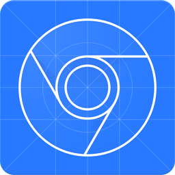
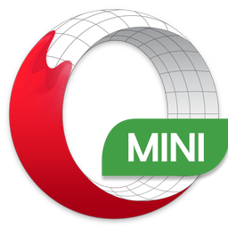
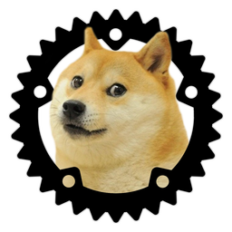
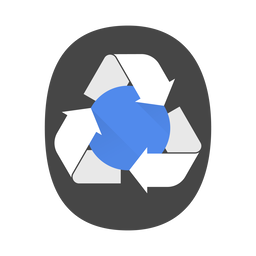

<!-- markdownlint-disable line-length no-inline-html -->

Current browser logos
=====================

Android
-------

<table>
    <thead>
        <tr>
            <th>
                <a href="https://play.google.com/store/apps/details?id=com.google.android.webview">Android WebView</a>
            </th>
            <th>
                <a href="https://play.google.com/store/apps/details?id=com.google.android.webview.beta">Android WebView Beta</a>
            </th>
            <th>
                <a href="https://play.google.com/store/apps/details?id=com.google.android.webview.dev">Android WebView Dev</a>
            </th>
            <th>
                <a href="https://play.google.com/store/apps/details?id=com.google.android.webview.canary">Android WebView Canary</a>
            </th>
        </tr>
    </thead>
    <tbody>
        <tr height=170>
            <td>
                
            </td>
            <td>
                
            </td>
            <td>
                
            </td>
            <td>
                
            </td>
        </tr>
        </tr>
    </tbody>
</table>

Avant
-----

<table>
    <thead>
        <tr>
            <th>
                <a href="http://www.avantbrowser.com/">Avant</a>
            </th>
        </tr>
    </thead>
    <tbody>
        <tr height=170>
            <td>
                
            </td>
        </tr>
    </tbody>
</table>

Basilisk
--------

<table>
    <thead>
        <tr>
            <th>
                <a href="https://www.basilisk-browser.org">Basilisk</a>
            </th>
        </tr>
    </thead>
    <tbody>
        <tr height=170>
            <td>
                
            </td>
        </tr>
    </tbody>
</table>

Brave
-----

<table>
    <thead>
        <tr>
            <th>
                <a href="https://www.brave.com/">Brave</a>
            </th>
            <th>
                <a href="https://brave.com/download-beta/">Brave Beta</a>
            </th>
            <th>
                <a href="https://brave.com/download-dev/">Brave Dev</a>
            </th>
            <th>
                <a href="https://brave.com/download-nightly/">Brave Nightly</a>
            </th>
        </tr>
    </thead>
    <tbody>
        <tr height=170>
            <td>
                
            </td>
            <td>
                
            </td>
            <td>
                
            </td>
            <td>
                
            </td>
        </tr>
    </tbody>
</table>

browsh
------

<table>
    <thead>
        <tr>
            <th>
                <a href="https://www.brow.sh/">browsh</a>
            </th>
        </tr>
    </thead>
    <tbody>
        <tr height=170>
            <td>
                
            </td>
        </tr>
    </tbody>
</table>

Chrome
------

<table>
    <thead>
        <tr>
            <th>
                <a href="https://www.google.com/chrome/">Chrome</a>
            </th>
            <th>
                <a href="https://www.google.com/chrome/browser/beta.html">Chrome Beta</a>
            </th>
            <th>
                <a href="https://www.chromium.org/getting-involved/dev-channel">Chrome Dev</a>
            </th>
            <th>
                <a href="https://www.google.com/intl/en/chrome/browser/canary.html">Chrome Canary</a>
            </th>
            <th>
                <a href="https://googlechromelabs.github.io/chrome-for-testing/">Chrome Test</a>
            </th>
        </tr>
    </thead>
    <tbody>
        <tr height=170>
            <td>
                
            </td>
            <td>
                
            </td>
            <td>
                
            </td>
            <td>
                
            </td>
            <td>
                
            </td>
        </tr>
    </tbody>
</table>

Chrome DevTools
---------------

<table>
    <thead>
        <tr>
            <th>
                <a href="https://developers.google.com/web/tools/chrome-devtools/">Chrome DevTools</a>
            </th>
        </tr>
    </thead>
    <tbody>
        <tr height=170>
            <td>
                
            </td>
        </tr>
    </tbody>
</table>

Chromium
--------

<table>
    <thead>
        <tr>
            <th>
                <a href="https://www.chromium.org/Home">Chromium</a>
            </th>
        </tr>
    </thead>
    <tbody>
        <tr height=170>
            <td>
                
            </td>
        </tr>
    </tbody>
</table>

Cốc Cốc
-------

<table>
    <thead>
        <tr>
            <th>
                <a href="https://coccoc.com/">Cốc Cốc</a>
            </th>
        </tr>
    </thead>
    <tbody>
        <tr height=170>
            <td>
                
            </td>
        </tr>
    </tbody>
</table>

Deno
----

<table>
    <thead>
        <tr>
            <th>
                <a href="https://deno.land/">Deno</a>
            </th>
        </tr>
    </thead>
    <tbody>
        <tr height=170>
            <td>
                
            </td>
        </tr>
    </tbody>
</table>

Dolphin
-------

<table>
    <thead>
        <tr>
            <th>
                <a href="https://dolphin.com/">Dolphin</a>
            </th>
        </tr>
    </thead>
    <tbody>
        <tr height=170>
            <td>
                
            </td>
        </tr>
    </tbody>
</table>

Edge
----

<table>
    <thead>
        <tr>
            <th>
                <a href="https://www.microsoft.com/en-us/windows/microsoft-edge">Edge</a>
            </th>
            <th>
                <a href="https://www.microsoftedgeinsider.com/en-us/download/">Edge Beta</a>
            </th>
            <th>
                <a href="https://www.microsoftedgeinsider.com/en-us/download/">Edge Dev</a>
            </th>
            <th>
                <a href="https://www.microsoftedgeinsider.com/en-us/download/">Edge Canary</a>
            </th>
        </tr>
    </thead>
    <tbody>
        <tr height=170>
            <td>
                
            </td>
            <td>
                
            </td>
            <td>
                
            </td>
            <td>
                
            </td>
        </tr>
    </tbody>
</table>

Electron
--------

<table>
    <thead>
        <tr>
            <th>
                <a href="https://electron.atom.io/">Electron</a>
            </th>
        </tr>
    </thead>
    <tbody>
        <tr height=170>
            <td>
                
            </td>
        </tr>
    </tbody>
</table>

Epic
----

<table>
    <thead>
        <tr>
            <th>
                <a href="https://www.epicbrowser.com/">Epic</a>
            </th>
        </tr>
    </thead>
    <tbody>
        <tr height=170>
            <td>
                
            </td>
        </tr>
    </tbody>
</table>

Falkon
------

<table>
    <thead>
        <tr>
            <th>
                <a href="https://www.falkon.org/">Falkon</a>
            </th>
        </tr>
    </thead>
    <tbody>
        <tr height=170>
            <td>
                
            </td>
        </tr>
    </tbody>
</table>

Firefox
-------

<table>
    <thead>
        <tr>
            <th>
                <a href="https://www.mozilla.org/en-US/firefox/new/">Firefox</a>
            </th>
            <th>
                <a href="https://www.mozilla.org/en-US/firefox/channel/desktop/#beta">Firefox Beta</a>
            </th>
            <th>
                <a href="https://www.mozilla.org/en-US/firefox/channel/#developer">Firefox Developer Edition</a>
            </th>
            <th>
                <a href="https://www.mozilla.org/en-US/firefox/channel/desktop/#nightly">Firefox Nightly</a>
            </th>
        </tr>
    </thead>
    <tbody>
        <tr height=170>
            <td>
                
            </td>
            <td>
                
            </td>
            <td>
                
            </td>
            <td>
                
            </td>
        </tr>
    </tbody>
</table>

Firefox Reality
---------------

<table>
    <thead>
        <tr>
            <th>
                <a href="https://mixedreality.mozilla.org/firefox-reality/">Firefox Reality</a>
            </th>
        </tr>
    </thead>
    <tbody>
        <tr height=170>
            <td>
                
            </td>
        </tr>
    </tbody>
</table>

GeckoView
---------

<table>
    <thead>
        <tr>
            <th>
                <a href="https://mozilla.github.io/geckoview/">GeckoView</a>
            </th>
        </tr>
    </thead>
    <tbody>
        <tr height=170>
            <td>
                
            </td>
        </tr>
    </tbody>
</table>

Hermes
------

<table>
    <thead>
        <tr>
            <th>
                <a href="https://github.com/facebook/hermes">Hermes</a>
            </th>
        </tr>
    </thead>
    <tbody>
        <tr height=170>
            <td>
                
            </td>
        </tr>
    </tbody>
</table>

IceCat
------

<table>
    <thead>
        <tr>
            <th>
                <a href="https://www.gnu.org/software/gnuzilla/">IceCat</a>
            </th>
        </tr>
    </thead>
    <tbody>
        <tr height=170>
            <td>
                
            </td>
        </tr>
    </tbody>
</table>

jsdom
-----

<table>
    <thead>
        <tr>
            <th>
                <a href="https://github.com/jsdom/jsdom">jsdom</a>
            </th>
        </tr>
    </thead>
    <tbody>
        <tr height=170>
            <td>
                
            </td>
        </tr>
    </tbody>
</table>

Konqueror
---------

<table>
    <thead>
        <tr>
            <th>
                <a href="https://kde.org/applications/internet/org.kde.konqueror">Konqueror</a>
            </th>
        </tr>
    </thead>
    <tbody>
        <tr height=170>
            <td>
                
            </td>
        </tr>
    </tbody>
</table>

Maxthon
-------

<table>
    <thead>
        <tr>
            <th>
                <a href="https://www.maxthon.com/">Maxthon</a>
            </th>
        </tr>
    </thead>
    <tbody>
        <tr height=170>
            <td>
                
            </td>
        </tr>
    </tbody>
</table>

Midori
------

<table>
    <thead>
        <tr>
            <th>
                <a href="https://en.wikipedia.org/wiki/Midori_%28web_browser%29">Midori</a>
            </th>
        </tr>
    </thead>
    <tbody>
        <tr height=170>
            <td>
                
            </td>
        </tr>
    </tbody>
</table>

NetSurf
-------

<table>
    <thead>
        <tr>
            <th>
                <a href="https://www.netsurf-browser.org/">NetSurf</a>
            </th>
        </tr>
    </thead>
    <tbody>
        <tr height=170>
            <td>
                
            </td>
        </tr>
    </tbody>
</table>

Node.js
-------

<table>
    <thead>
        <tr>
            <th>
                <a href="https://nodejs.org/">Node.js</a>
            </th>
        </tr>
    </thead>
    <tbody>
        <tr height=170>
            <td>
                
            </td>
        </tr>
    </tbody>
</table>

NW.js
-----

<table>
    <thead>
        <tr>
            <th>
                <a href="https://nwjs.io/">NW.js</a>
            </th>
        </tr>
    </thead>
    <tbody>
        <tr height=170>
            <td>
                
            </td>
        </tr>
    </tbody>
</table>

Opera
-----

<table>
    <thead>
        <tr>
            <th>
                <a href="https://www.opera.com/">Opera</a>
            </th>
            <th>
                <a href="https://www.opera.com/computer/beta">Opera Beta</a>
            </th>
            <th>
                <a href="https://www.opera.com/computer/beta">Opera Developer</a>
            </th>
        </tr>
    </thead>
    <tbody>
        <tr height=170>
            <td>
                
            </td>
            <td>
                
            </td>
            <td>
                
            </td>
        </tr>
    </tbody>
</table>

Opera GX
--------

<table>
    <thead>
        <tr>
            <th>
                <a href="https://www.opera.com/gx">Opera GX</a>
            </th>
        </tr>
    </thead>
    <tbody>
        <tr height=170>
            <td>
                
            </td>
        </tr>
    </tbody>
</table>

Opera Mini
----------

<table>
    <thead>
        <tr>
            <th>
                <a href="https://www.opera.com/mobile/mini">Opera Mini</a>
            </th>
            <th>
                <a href="https://www.opera.com/mobile/mini">Opera Mini Beta</a>
            </th>
        </tr>
    </thead>
    <tbody>
        <tr height=170>
            <td>
                
            </td>
            <td>
                
            </td>
        </tr>
    </tbody>
</table>

Opera Neon
----------

<table>
    <thead>
        <tr>
            <th>
                <a href="https://www.opera.com/computer/neon">Opera Neon</a>
            </th>
        </tr>
    </thead>
    <tbody>
        <tr height=170>
            <td>
                
            </td>
        </tr>
    </tbody>
</table>

Opera Touch
-----------

<table>
    <thead>
        <tr>
            <th>
                <a href="https://www.opera.com/mobile/touch">Opera Touch</a>
            </th>
        </tr>
    </thead>
    <tbody>
        <tr height=170>
            <td>
                
            </td>
        </tr>
    </tbody>
</table>

Otter
-----

<table>
    <thead>
        <tr>
            <th>
                <a href="https://otter-browser.org/">Otter</a>
            </th>
        </tr>
    </thead>
    <tbody>
        <tr height=170>
            <td>
                
            </td>
        </tr>
    </tbody>
</table>

Puffin
------

<table>
    <thead>
        <tr>
            <th>
                <a href="https://www.puffinbrowser.com/">Puffin</a>
            </th>
        </tr>
    </thead>
    <tbody>
        <tr height=170>
            <td>
                
            </td>
        </tr>
    </tbody>
</table>

Safari
------

<table>
    <thead>
        <tr>
            <th>
                <a href="https://www.apple.com/safari/">Safari</a>
            </th>
            <th>
                <a href="https://developer.apple.com/safari/technology-preview/">Safari Technology Preview</a>
            </th>
        </tr>
    </thead>
    <tbody>
        <tr height=170>
            <td>
                
            </td>
            <td>
                
            </td>
        </tr>
    </tbody>
</table>

Safari (iOS)
------------

<table>
    <thead>
        <tr>
            <th>
                <a href="https://www.apple.com/safari/">Safari (iOS)</a>
            </th>
        </tr>
    </thead>
    <tbody>
        <tr height=170>
            <td>
                
            </td>
        </tr>
    </tbody>
</table>

Samsung Internet
----------------

<table>
    <thead>
        <tr>
            <th>
                <a href="https://developer.samsung.com/internet">Samsung Internet</a>
            </th>
            <th>
                <a href="https://samsunginter.net/">Samsung Internet Beta</a>
            </th>
        </tr>
    </thead>
    <tbody>
        <tr height=170>
            <td>
                
            </td>
            <td>
                
            </td>
        </tr>
    </tbody>
</table>

SeaMonkey
---------

<table>
    <thead>
        <tr>
            <th>
                <a href="https://www.seamonkey-project.org/">SeaMonkey</a>
            </th>
        </tr>
    </thead>
    <tbody>
        <tr height=170>
            <td>
                
            </td>
        </tr>
    </tbody>
</table>

Servo
-----

<table>
    <thead>
        <tr>
            <th>
                <a href="https://servo.org/">Servo</a>
            </th>
        </tr>
    </thead>
    <tbody>
        <tr height=170>
            <td>
                
            </td>
        </tr>
    </tbody>
</table>

Silk
----

<table>
    <thead>
        <tr>
            <th>
                <a href="https://docs.aws.amazon.com/silk/latest/developerguide/introduction.html">Silk</a>
            </th>
        </tr>
    </thead>
    <tbody>
        <tr height=170>
            <td>
                
            </td>
        </tr>
    </tbody>
</table>

Sogou (Mobile)
--------------

<table>
    <thead>
        <tr>
            <th>
                <a href="https://mse.sogou.com/">Sogou (Mobile)</a>
            </th>
        </tr>
    </thead>
    <tbody>
        <tr height=170>
            <td>
                
            </td>
        </tr>
    </tbody>
</table>

Tor
---

<table>
    <thead>
        <tr>
            <th>
                <a href="https://www.torproject.org/">Tor</a>
            </th>
            <th>
                <a href="https://www.torproject.org/">Tor Alpha</a>
            </th>
            <th>
                <a href="https://www.torproject.org/">Tor Nightly</a>
            </th>
        </tr>
    </thead>
    <tbody>
        <tr height=170>
            <td>
                
            </td>
            <td>
                
            </td>
            <td>
                
            </td>
        </tr>
    </tbody>
</table>

SpiderMonkey
------------

<table>
    <thead>
        <tr>
            <th>
                <a href="https://spidermonkey.dev/">SpiderMonkey</a>
            </th>
        </tr>
    </thead>
    <tbody>
        <tr height=170>
            <td>
                
            </td>
        </tr>
    </tbody>
</table>

UC
--

<table>
    <thead>
        <tr>
            <th>
                <a href="https://www.ucweb.com">UC</a>
            </th>
        </tr>
    </thead>
    <tbody>
        <tr height=170>
            <td>
                
            </td>
        </tr>
    </tbody>
</table>

UC Mini
-------

<table>
    <thead>
        <tr>
            <th>
                <a href="https://www.ucweb.com">UC Mini</a>
            </th>
        </tr>
    </thead>
    <tbody>
        <tr height=170>
            <td>
                
            </td>
        </tr>
    </tbody>
</table>

V8
--

<table>
    <thead>
        <tr>
            <th>
                <a href="https://v8.dev/">V8</a>
            </th>
        </tr>
    </thead>
    <tbody>
        <tr height=170>
            <td>
                
            </td>
        </tr>
    </tbody>
</table>

V8 Ignition
-----------

<table>
    <thead>
        <tr>
            <th>
                <a href="https://v8.dev/">V8 Ignition</a>
            </th>
        </tr>
    </thead>
    <tbody>
        <tr height=170>
            <td>
                
            </td>
        </tr>
    </tbody>
</table>

V8 Liftoff
----------

<table>
    <thead>
        <tr>
            <th>
                <a href="https://v8.dev/">V8 Liftoff</a>
            </th>
        </tr>
    </thead>
    <tbody>
        <tr height=170>
            <td>
                
            </td>
        </tr>
    </tbody>
</table>

V8 Orinoco
----------

<table>
    <thead>
        <tr>
            <th>
                <a href="https://v8.dev/">V8 Orinoco</a>
            </th>
        </tr>
    </thead>
    <tbody>
        <tr height=170>
            <td>
                
            </td>
        </tr>
    </tbody>
</table>

V8 TurboFan
-----------

<table>
    <thead>
        <tr>
            <th>
                <a href="https://v8.dev/">V8 TurboFan</a>
            </th>
        </tr>
    </thead>
    <tbody>
        <tr height=170>
            <td>
                
            </td>
        </tr>
    </tbody>
</table>

Vivaldi
-------

<table>
    <thead>
        <tr>
            <th>
                <a href="https://vivaldi.com/">Vivaldi</a>
            </th>
            <th>
                <a href="https://vivaldi.com/blog/snapshots/">Vivaldi Snapshot</a>
            </th>
        </tr>
    </thead>
    <tbody>
        <tr height=170>
            <td>
                
            </td>
            <td>
                
            </td>
        </tr>
    </tbody>
</table>

Web
---

<table>
    <thead>
        <tr>
            <th>
                <a href="https://wiki.gnome.org/Apps/Web">Web  (f.k.a. Epiphany)</a>
            </th>
             <th>
                <a href="https://wiki.gnome.org/Apps/Web/Development#Epiphany_Technology_Preview">Epiphany Technology Preview</a>
            </th>
        </tr>
    </thead>
    <tbody>
        <tr height=170>
            <td>
                
            </td>
            <td>
                
            </td>
        </tr>
    </tbody>
</table>

WebKit
------

<table>
    <thead>
        <tr>
            <th>
                <a href="https://webkit.org/">WebKit</a>
            </th>
        </tr>
    </thead>
    <tbody>
        <tr height=170>
            <td>
                
            </td>
        </tr>
    </tbody>
</table>

WebKit Nightly
--------------

<table>
    <thead>
        <tr>
            <th>
                <a href="https://webkit.org/downloads/">WebKit Nightly</a>
            </th>
        </tr>
    </thead>
    <tbody>
        <tr height=170>
            <td>
                
            </td>
        </tr>
    </tbody>
</table>

Yandex
------

<table>
    <thead>
        <tr>
            <th>
                <a href="https://browser.yandex.com/">Yandex</a>
            </th>
            <th>
                <a href="https://browser.yandex.com/">Yandex Beta</a>
            </th>
            <th>
                <a href="https://browser.yandex.com/">Yandex Alpha</a>
            </th>
            <th>
                <a href="https://yandex.com/support/browser-mobile-lite/index.html">Yandex Lite</a>
            </th>
        </tr>
    </thead>
    <tbody>
        <tr height=170>
            <td>
                
            </td>
            <td>
                
            </td>
            <td>
                
            </td>
            <td>
                
            </td>
        </tr>
    </tbody>
</table>
