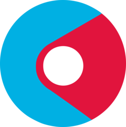
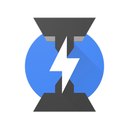

### Adblock

<table>
    <thead>
        <tr>
            <th><a href="https://adblockbrowser.org/">Adblock</a></th>
        </tr>
    </thead>
    <tbody>
        <tr height=170>
            <td></td>
        </tr>
    </tbody>
</table>

### Amazon Internet

<table>
    <thead>
        <tr>
            <th><a href="https://play.google.com/store/apps/details?id=com.amazon.cloud9.garuda">Amazon Internet</a></th>
        </tr>
    </thead>
    <tbody>
        <tr height=170>
            <td></td>
        </tr>
    </tbody>
</table>

### Android

<table>
    <thead>
        <tr>
            <th><a href="https://play.google.com/store/apps/details?id=com.google.android.webview">Android WebView Beta</a></th>
        </tr>
    </thead>
    <tbody>
        <tr height=170>
            <td></td>
        </tr>
    </tbody>
</table>

### Avant

<table>
    <thead>
        <tr>
            <th><a href="http://www.avantbrowser.com/">Avant</a></th>
        </tr>
    </thead>
    <tbody>
        <tr height=170>
            <td></td>
        </tr>
    </tbody>
</table>

### Beaker

<table>
    <thead>
        <tr>
            <th><a href="https://beakerbrowser.com/">Beaker</a></th>
        </tr>
    </thead>
    <tbody>
        <tr height=170>
            <td></td>
        </tr>
    </tbody>
</table>

### Blisk

<table>
    <thead>
        <tr>
            <th><a href="https://blisk.io/">Blisk</a></th>
        </tr>
    </thead>
    <tbody>
        <tr height=170>
            <td></td>
        </tr>
    </tbody>
</table>

### Brave

<table>
    <thead>
        <tr>
            <th><a href="https://www.brave.com/">Brave</a></th>
            <th><a href="https://brave.com/download-dev/">Brave Dev</a></th>
        </tr>
    </thead>
    <tbody>
        <tr height=170>
            <td></td>
            <td></td>
        </tr>
    </tbody>
</table>

### browsh

<table>
    <thead>
        <tr>
            <th><a href="https://www.brow.sh/">browsh</a></th>
        </tr>
    </thead>
    <tbody>
        <tr height=170>
            <td></td>
        </tr>
    </tbody>
</table>

#### Cent

<table>
    <thead>
        <tr>
            <th><a href="http://www.centbrowser.com">Cent</a></th>
        <tr>
    </thead>
    <tbody>
        <tr height=170>
            <td></td>
        <tr>
    </tbody>
</table>

### Chrome

<table>
    <thead>
        <tr>
            <th><a href="https://www.google.com/chrome/">Chrome</a></th>
            <th><a href="https://www.google.com/chrome/browser/beta.html">Chrome Beta</a></th>
            <th><a href="https://www.chromium.org/getting-involved/dev-channel">Chrome Dev</a></th>
            <th><a href="https://www.google.com/intl/en/chrome/browser/canary.html">Chrome Canary</a></th>
        </tr>
    </thead>
    <tbody>
        <tr height=170>
            <td></td>
            <td></td>
            <td></td>
            <td></td>
        </tr>
    </tbody>
</table>

#### Chrome DevTools

<table>
    <thead>
        <tr>
            <th><a href="https://developers.google.com/web/tools/chrome-devtools/">Chrome DevTools</a></th>
        <tr>
    </thead>
    <tbody>
        <tr height=170>
            <td></td>
        <tr>
    </tbody>
</table>

### Chromium

<table>
    <thead>
        <tr>
            <th><a href="https://www.chromium.org/Home">Chromium</a></th>
        </tr>
    </thead>
    <tbody>
        <tr height=170>
            <td></td>
        </tr>
    </tbody>
</table>

### CM

<table>
    <thead>
        <tr>
            <th><a href="https://www.cmcm.com/en-us/cm-browser/">CM</a></th>
        </tr>
    </thead>
    <tbody>
        <tr height=170>
            <td></td>
        </tr>
    </tbody>
</table>

### Cốc Cốc

<table>
    <thead>
        <tr>
            <th><a href="https://coccoc.com/">Cốc Cốc</a></th>
        </tr>
    </thead>
    <tbody>
        <tr height=170>
            <td></td>
        </tr>
    </tbody>
</table>

### Crusta

<table>
    <thead>
        <tr>
            <th><a href="https://github.com/Crusta/CrustaBrowser">Crusta</a></th>
        </tr>
    </thead>
    <tbody>
        <tr height=170>
            <td></td>
        </tr>
    </tbody>
</table>

### Dolphin

<table>
    <thead>
        <tr>
            <th><a href="https://dolphin.com/">Dolphin</a></th>
        </tr>
    </thead>
    <tbody>
        <tr height=170>
            <td></td>
        </tr>
    </tbody>
</table>

### Dooble

<table>
    <thead>
        <tr>
            <th><a href="https://textbrowser.github.io/dooble/">Dooble</a></th>
        </tr>
    </thead>
    <tbody>
        <tr height=170>
            <td></td>
        </tr>
    </tbody>
</table>

### Edge

<table>
    <thead>
        <tr>
            <th><a href="https://www.microsoft.com/en-us/windows/microsoft-edge">Edge</a></th>
            <th><a href="https://www.microsoft.com/en-us/windows/microsoft-edge">Edge Tile</a></th>
            <th><a href="https://www.microsoft.com/en-us/windows/microsoft-edge">Edge Beta</a></th>
            <th><a href="https://www.microsoft.com/en-us/windows/microsoft-edge">Edge Beta</a></th>
        </tr>
    </thead>
    <tbody>
        <tr height=170>
            <td></td>
            <td></td>
            <td></td>
            <td></td>
        </tr>
    </tbody>
</table>

### Electron

<table>
    <thead>
        <tr>
            <th><a href="https://electron.atom.io/">Electron</a></th>
        </tr>
    </thead>
    <tbody>
        <tr height=170>
            <td></td>
        </tr>
    </tbody>
</table>

### Epic

<table>
    <thead>
        <tr>
            <th><a href="https://www.epicbrowser.com/">Epic</a></th>
        </tr>
    </thead>
    <tbody>
        <tr height=170>
            <td></td>
        </tr>
    </tbody>
</table>

### Falkon

<table>
    <thead>
        <tr>
            <th><a href="https://www.falkon.org/">Falkon</a></th>
        </tr>
    </thead>
    <tbody>
        <tr height=170>
            <td></td>
        </tr>
    </tbody>
</table>

### Firefox

<table>
    <thead>
        <tr>
            <th><a href="https://www.mozilla.org/en-US/firefox/new/">Firefox</a></th>
            <th><a href="https://www.mozilla.org/en-US/firefox/channel/#beta">Firefox Beta</a></th>
            <th><a href="https://www.mozilla.org/en-US/firefox/channel/#developer">Firefox Developer Edition</a></th>
            <th><a href="https://nightly.mozilla.org/">Firefox Nightly</a></th>
            <th><a href="https://mixedreality.mozilla.org/firefox-reality/">Firefox Reality</a></th>
        </tr>
    </thead>
    <tbody>
        <tr height=170>
            <td></td>
            <td></td>
            <td></td>
            <td></td>
            <td></td>
        </tr>
    </tbody>
</table>

### Firefox Focus

<table>
    <thead>
        <tr>
            <th><a href="https://www.mozilla.org/en-US/firefox/focus/">Firefox Focus</a></th>
        </tr>
    </thead>
    <tbody>
        <tr height=170>
            <td></td>
        </tr>
    </tbody>
</table>

### iCab (Mobile)

<table>
    <thead>
        <tr>
            <th><a href="http://www.icab.de/mobile.html">iCab (Mobile)</a></th>
        </tr>
    </thead>
    <tbody>
        <tr height=170>
            <td></td>
        </tr>
    </tbody>
</table>

### IceCat

<table>
    <thead>
        <tr>
            <th><a href="https://www.gnu.org/software/gnuzilla/">IceCat</a></th>
        </tr>
    </thead>
    <tbody>
        <tr height=170>
            <td></td>
        </tr>
    </tbody>
</table>

### jsdom

<table>
    <thead>
        <tr>
            <th><a href="https://github.com/jsdom/jsdom">jsdom</a></th>
        </tr>
    </thead>
    <tbody>
        <tr height=170>
            <td></td>
        </tr>
    </tbody>
</table>

### Lightning

<table>
    <thead>
        <tr>
            <th><a href="https://github.com/anthonycr/Lightning-Browser/">Lightning</a></th>
        </tr>
    </thead>
    <tbody>
        <tr height=170>
            <td></td>
        </tr>
    </tbody>
</table>

### Maxthon

<table>
    <thead>
        <tr>
            <th><a href="http://www.maxthon.com/">Maxthon</a></th>
        </tr>
    </thead>
    <tbody>
        <tr height=170>
            <td></td>
        </tr>
    </tbody>
</table>

### Midori

<table>
    <thead>
        <tr>
            <th><a href="https://en.wikipedia.org/wiki/Midori_%28web_browser%29">Midori</a></th>
        </tr>
    </thead>
    <tbody>
        <tr height=170>
            <td></td>
        </tr>
    </tbody>
</table>

### MIHTool

<table>
    <thead>
        <tr>
            <th><a href="http://www.mihtool.com/">MIHTool</a></th>
        </tr>
    </thead>
    <tbody>
        <tr height=170>
            <td></td>
        </tr>
    </tbody>
</table>

### Min

<table>
    <thead>
        <tr>
            <th><a href="https://palmeral.github.io/min/">Min</a></th>
        </tr>
    </thead>
    <tbody>
        <tr height=170>
            <td></td>
        </tr>
    </tbody>
</table>

### NetSurf

<table>
    <thead>
        <tr>
            <th><a href="http://www.netsurf-browser.org/">NetSurf</a></th>
        </tr>
    </thead>
    <tbody>
        <tr height=170>
            <td></td>
        </tr>
    </tbody>
</table>

### NW.js

<table>
    <thead>
        <tr>
            <th><a href="https://nwjs.io/">NW.js</a></th>
        </tr>
    </thead>
    <tbody>
        <tr height=170>
            <td></td>
        </tr>
    </tbody>
</table>

### Onion

<table>
    <thead>
        <tr>
            <th><a href="https://mike.tig.as/onionbrowser/">Onion</a></th>
        </tr>
    </thead>
    <tbody>
        <tr height=170>
            <td></td>
        </tr>
    </tbody>
</table>

### Opera

<table>
    <thead>
        <tr>
            <th><a href="https://www.opera.com/">Opera</a></th>
            <th><a href="https://www.opera.com/computer/beta">Opera Beta</a></th>
            <th><a href="https://www.opera.com/computer/beta">Opera Developer</a></th>
        </tr>
    </thead>
    <tbody>
        <tr height=170>
            <td></td>
            <td></td>
            <td></td>
        </tr>
    </tbody>
</table>

### Opera Mini

<table>
    <thead>
        <tr>
            <th><a href="https://www.opera.com/mobile/mini">Opera Mini</a></th>
            <th><a href="https://www.opera.com/mobile/mini">Opera Mini Beta</a></th>
        </tr>
    </thead>
    <tbody>
        <tr height=170>
            <td></td>
            <td></td>
        </tr>
    </tbody>
</table>

### Opera Neon

<table>
    <thead>
        <tr>
            <th><a href="https://www.opera.com/computer/neon">Opera Neon</a></th>
        </tr>
    </thead>
    <tbody>
        <tr height=170>
            <td></td>
        </tr>
    </tbody>
</table>

### Opera Touch

<table>
    <thead>
        <tr>
            <th><a href="https://www.opera.com/mobile/touch">Opera Touch</a></th>
        </tr>
    </thead>
    <tbody>
        <tr height=170>
            <td></td>
        </tr>
    </tbody>
</table>

### Orbitum

<table>
    <thead>
        <tr>
            <th><a href="https://orbitum.com/">Orbitum</a></th>
        </tr>
    </thead>
    <tbody>
        <tr height=170>
            <td></td>
        </tr>
    </tbody>
</table>

### Otter

<table>
    <thead>
        <tr>
            <th><a href="http://otter-browser.org/">Otter</a></th>
        </tr>
    </thead>
    <tbody>
        <tr height=170>
            <td></td>
        </tr>
    </tbody>
</table>

### Pale Moon

<table>
    <thead>
        <tr>
            <th><a href="http://www.palemoon.org/">Pale Moon</a></th>
        </tr>
    </thead>
    <tbody>
        <tr height=170>
            <td></td>
        </tr>
    </tbody>
</table>

### Polarity

<table>
    <thead>
        <tr>
            <th><a href="http://polarityweb.weebly.com/">Polarity</a></th>
        </tr>
    </thead>
    <tbody>
        <tr height=170>
            <td></td>
        </tr>
    </tbody>
</table>

### Puffin

<table>
    <thead>
        <tr>
            <th><a href="https://www.puffinbrowser.com/">Puffin</a></th>
        </tr>
    </thead>
    <tbody>
        <tr height=170>
            <td></td>
        </tr>
    </tbody>
</table>

### qutebrowser

<table>
    <thead>
        <tr>
            <th><a href="https://www.qutebrowser.org/">qutebrowser</a></th>
        </tr>
    </thead>
    <tbody>
        <tr height=170>
            <td></td>
        </tr>
    </tbody>
</table>

### Safari

<table>
    <thead>
        <tr>
            <th><a href="https://www.apple.com/safari/">Safari</a></th>
            <th><a href="https://developer.apple.com/safari/technology-preview/">Safari Technology Preview</a></th>
        </tr>
    </thead>
    <tbody>
        <tr height=170>
            <td></td>
            <td></td>
        </tr>
    </tbody>
</table>

### Safari (iOS)

<table>
    <thead>
        <tr>
            <th><a href="https://www.apple.com/safari/">Safari (iOS)</a></th>
        </tr>
    </thead>
    <tbody>
        <tr height=170>
            <td></td>
        </tr>
    </tbody>
</table>

### Samsung Internet

<table>
    <thead>
        <tr>
            <th><a href="https://developer.samsung.com/internet">Samsung Internet</a></th>
            <th><a href="https://samsunginter.net/">Samsung Internet Beta</a></th>
        </tr>
    </thead>
    <tbody>
        <tr height=170>
            <td></td>
            <td></td>
        </tr>
    </tbody>
</table>

### SeaMonkey

<table>
    <thead>
        <tr>
            <th><a href="http://www.seamonkey-project.org/">SeaMonkey</a></th>
        </tr>
    </thead>
    <tbody>
        <tr height=170>
            <td></td>
        </tr>
    </tbody>
</table>

### Servo

<table>
    <thead>
        <tr>
            <th><a href="https://servo.org/">Servo</a></th>
        </tr>
    </thead>
    <tbody>
        <tr height=170>
            <td></td>
        </tr>
    </tbody>
</table>

### Silk

<table>
    <thead>
        <tr>
            <th><a href="https://docs.aws.amazon.com/silk/latest/developerguide/introduction.html">Silk</a></th>
        </tr>
    </thead>
    <tbody>
        <tr height=170>
            <td></td>
        </tr>
    </tbody>
</table>

### Sogou (Mobile)

<table>
    <thead>
        <tr>
            <th><a href="https://mse.sogou.com/">Sogou (Mobile)</a></th>
        </tr>
    </thead>
    <tbody>
        <tr height=170>
            <td></td>
        </tr>
    </tbody>
</table>

### Tor

<table>
    <thead>
        <tr>
            <th><a href="https://www.torproject.org/">Tor</a></th>
        </tr>
    </thead>
    <tbody>
        <tr height=170>
            <td></td>
        </tr>
    </tbody>
</table>

### UC

<table>
    <thead>
        <tr>
            <th><a href="http://www.ucweb.com">UC</a></th>
        </tr>
    </thead>
    <tbody>
        <tr height=170>
            <td></td>
        </tr>
    </tbody>
</table>

### UC Mini

<table>
    <thead>
        <tr>
            <th><a href="http://www.ucweb.com">UC Mini</a></th>
        </tr>
    </thead>
    <tbody>
        <tr height=170>
            <td></td>
        </tr>
    </tbody>
</table>

### V8

<table>
    <thead>
        <tr>
            <th><a href="https://v8.dev/">V8</a></th>
            <th><a href="https://v8.dev/">V8 (with outline)</a></th>
        </tr>
    </thead>
    <tbody>
        <tr height=170>
            <td></td>
           <td></td>
        </tr>
    </tbody>
</table>

### V8 Ignition

<table>
    <thead>
        <tr>
            <th><a href="https://v8.dev/">V8 Ignition</a></th>
            <th><a href="https://v8.dev/">V8 Ignition (with outline)</a></th>
        </tr>
    </thead>
    <tbody>
        <tr height=170>
            <td></td>
            <td></td>
        </tr>
    </tbody>
</table>

### V8 Liftoff

<table>
    <thead>
        <tr>
            <th><a href="https://v8.dev/">V8 Liftoff</a></th>
            <th><a href="https://v8.dev/">V8 Liftoff (with outline)</a></th>
        </tr>
    </thead>
    <tbody>
        <tr height=170>
            <td></td>
            <td></td>
        </tr>
    </tbody>
</table>

### V8 Orinoco

<table>
    <thead>
        <tr>
            <th><a href="https://v8.dev/">V8 Orinoco</a></th>
            <th><a href="https://v8.dev/">V8 Orinoco (with outline)</a></th>
        </tr>
    </thead>
    <tbody>
        <tr height=170>
            <td></td>
            <td></td>
        </tr>
    </tbody>
</table>

### V8 TurboFan

<table>
    <thead>
        <tr>
            <th><a href="https://v8.dev/">V8 TurboFan</a></th>
            <th><a href="https://v8.dev/">V8 TurboFan (with outline)</a></th>
        </tr>
    </thead>
    <tbody>
        <tr height=170>
            <td></td>
            <td></td>
        </tr>
    </tbody>
</table>

### Vivaldi

<table>
    <thead>
        <tr>
            <th><a href="https://vivaldi.com/">Vivaldi</a></th>
            <th><a href="https://vivaldi.com/blog/snapshots/">Vivaldi Snapshot</a></th>
        </tr>
    </thead>
    <tbody>
        <tr height=170>
            <td></td>
            <td></td>
        </tr>
    </tbody>
</table>

### WaterFox

<table>
    <thead>
        <tr>
            <th><a href="https://www.waterfoxproject.org/">WaterFox</a></th>
        </tr>
    </thead>
    <tbody>
        <tr height=170>
            <td></td>
        </tr>
    </tbody>
</table>

### Web

<table>
    <thead>
        <tr>
            <th><a href="https://wiki.gnome.org/Apps/Web">Web  (f.k.a. Epiphany)</a></th>
        </tr>
    </thead>
    <tbody>
        <tr height=170>
            <td></td>
        </tr>
    </tbody>
</table>

### Yandex

<table>
    <thead>
        <tr>
            <th><a href="https://browser.yandex.com/">Yandex</a></th>
            <th><a href="https://browser.yandex.com/">Yandex Beta</a></th>
            <th><a href="https://browser.yandex.com/">Yandex Alpha</a></th>
            <th><a href="https://yandex.com/support/browser-mobile-lite/index.html">Yandex Lite</a></th>
        </tr>
    </thead>
    <tbody>
        <tr height=170>
            <td></td>
            <td></td>
            <td></td>
            <td></td>
        </tr>
    </tbody>
</table>
