### 360 Secure

<table>
    <thead>
        <tr>
            <th><a href="https://en.wikipedia.org/wiki/360_Secure_Browser">360 Secure</a></th>
        </tr>
    </thead>
    <tbody>
        <tr height=160>
            <td></td>
        </tr>
    </tbody>
</table>

### Adrenaline

<table>
    <thead>
        <tr>
            <th><a href="https://web.archive.org/web/20141218215235/http://www.adrenalinemobility.com/">Adrenaline</a></th>
        </tr>
    </thead>
    <tbody>
        <tr height=160>
            <td></td>
        </tr>
    </tbody>
</table>

### AirWeb

<table>
    <thead>
        <tr>
            <th><a href="https://web.archive.org/web/20160316122907/http://airwebapp.com/">AirWeb</a></th>
        </tr>
    </thead>
    <tbody>
        <tr height=160>
            <td></td>
        </tr>
    </tbody>
</table>

### AllInOne

<table>
    <thead>
        <tr>
            <th><a href="https://web.archive.org/web/20150801011234/http://allinonebrowser.com/">AllInOne</a></th>
        </tr>
    </thead>
    <tbody>
        <tr height=160>
            <td></td>
        </tr>
    </tbody>
</table>

### Amigo

<table>
    <thead>
        <tr>
            <th><a href="https://ru.wikipedia.org/wiki/%D0%90%D0%BC%D0%B8%D0%B3%D0%BE_%28%D0%B1%D1%80%D0%B0%D1%83%D0%B7%D0%B5%D1%80%29">Amigo</a> <a href="#note"><code>*</code></a></th>
        </tr>
    </thead>
    <tbody>
        <tr height=160>
            <td></td>
        </tr>
    </tbody>
</table>

### Apollo

<table>
    <thead>
        <tr>
            <th><a href="https://web.archive.org/web/20141006164535/http://apollobrowser.wordpress.com/the-most-innovative-browser-for-ipad/">Apollo</a></th>
        </tr>
    </thead>
    <tbody>
        <tr height=160>
            <td></td>
        </tr>
    </tbody>
</table>

### Arora

<table>
    <thead>
        <tr>
            <th><a href="https://en.wikipedia.org/wiki/Arora_%28web_browser%29">Arora</a></th>
        </tr>
    </thead>
    <tbody>
        <tr height=160>
            <td></td>
        </tr>
    </tbody>
</table>

### Atomic

<table>
    <thead>
        <tr>
            <th><a href="https://web.archive.org/web/20150801050429/http://atomicwebbrowser.com/">Atomic</a></th>
        </tr>
    </thead>
    <tbody>
        <tr height=160>
            <td></td>
        </tr>
    </tbody>
</table>

### Aviator

<table>
    <thead>
        <tr>
            <th><a href="https://web.archive.org/web/20151021044307/https://www.whitehatsec.com/aviator/">Aviator</a></th>
        </tr>
    </thead>
    <tbody>
        <tr height=160>
            <td></td>
        </tr>
    </tbody>
</table>

### Axis

<table>
    <thead>
        <tr>
            <th><a href="https://en.wikipedia.org/wiki/Yahoo!_Axis">Axis</a></th>
        </tr>
    </thead>
    <tbody>
        <tr height=160>
            <td></td>
        </tr>
    </tbody>
</table>

### Baidu (Mobile)

<table>
    <thead>
        <tr>
            <th><a href="https://web.archive.org/web/20150726085553/http://global.baidu.com/browser/">Baidu (Mobile)</a> <a href="#note"><code>*</code></a></th>
            <th><a href="https://web.archive.org/web/20150726085553/http://global.baidu.com/browser/">Baidu (Mobile)</a> <a href="#note"><code>*</code></a></th>
            <th><a href="https://web.archive.org/web/20150726085553/http://global.baidu.com/browser/">Baidu (Mobile)</a> <a href="#note"><code>*</code></a></th>
        </tr>
    </thead>
    <tbody>
        <tr height=160>
            <td></td>
            <td></td>
            <td></td>
        </tr>
    </tbody>
</table>

### Breach

<table>
    <thead>
        <tr>
            <td><a href="https://github.com/breach">Breach</a> <a href="#note"><code>*</code></a></td>
        </tr>
    </thead>
    <tbody>
        <tr height=160>
            <td><a href="breach">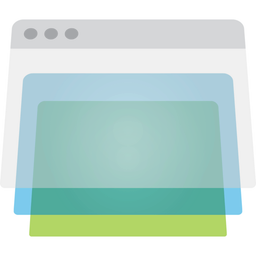</a></td>
        </tr>
    </tbody>
</table>

### Camino

<table>
    <thead>
        <tr>
            <th><a href="https://en.wikipedia.org/wiki/Camino">Camino</a></th>
        </tr>
    </thead>
    <tbody>
        <tr height=160>
            <td></td>
        </tr>
    </tbody>
</table>

### Cheetah

<table>
    <thead>
        <tr>
            <th><a href="https://en.wikipedia.org/wiki/Cheetah_Mobile">Cheetah</a></th>
        </tr>
    </thead>
    <tbody>
        <tr height=160>
            <td></td>
        </tr>
    </tbody>
</table>

### Chrome

<table>
    <thead>
        <tr>
            <th><a href="https://en.wikipedia.org/wiki/Google_Chrome">Chrome 1-11</a></th>
            <th><a href="https://en.wikipedia.org/wiki/Google_Chrome">Chrome 12-48</a></th>
        </tr>
    </thead>
    <tbody>
        <tr height=160>
            <td></td>
            <td></td>
        </tr>
    </tbody>
</table>

### Chrome Canary

<table>
    <thead>
        <tr>
            <th><a href="https://en.wikipedia.org/wiki/Google_Chrome#Pre-releases">Chrome Canary 19-48</a></th>
        </tr>
    </thead>
    <tbody>
        <tr height=160>
            <td></td>
        </tr>
    </tbody>
</table>

### Chrome (Android)

<table>
    <thead>
        <tr>
            <th><a href="https://en.wikipedia.org/wiki/Google_Chrome_for_Android">Chrome (Android)  25-36</a></th>
        </tr>
    </thead>
    <tbody>
        <tr height=160>
            <td></td>
        </tr>
    </tbody>
</table>

### Chrome Beta (Android)

<table>
    <thead>
        <tr>
            <th><a href="https://en.wikipedia.org/wiki/Google_Chrome_for_Android">Chrome Beta (Android) 25-36 </a></th>
        </tr>
    </thead>
    <tbody>
        <tr height=160>
            <td><a href="chrome-beta-android_25-36">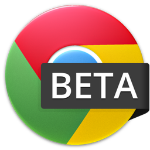</a></td>
        </tr>
    </tbody>
</table>

### Chromium

<table>
    <thead>
        <tr>
            <th><a href="https://en.wikipedia.org/wiki/Chromium_%28web_browser%29">Chromium 1-11</a></th>
            <th><a href="https://en.wikipedia.org/wiki/Chromium_%28web_browser%29">Chromium 12-48</a></th>
        </tr>
    </thead>
    <tbody>
        <tr height=160>
            <td></td>
            <td></td>
        </tr>
    </tbody>
</table>

### Cờ Rôm+

<table>
    <thead>
        <tr>
            <th><a href="https://en.wikipedia.org/wiki/C%E1%BB%91c_C%E1%BB%91c">Cờ Rôm+</a></th>
        </tr>
    </thead>
    <tbody>
        <tr height=160>
            <td></td>
        </tr>
    </tbody>
</table>

### Cruz

<table>
    <thead>
        <tr>
            <th><a href="https://en.wikipedia.org/wiki/Fluid_%28web_browser%29">Cruz</a></th>
        </tr>
    </thead>
    <tbody>
        <tr height=160>
            <td></td>
        </tr>
    </tbody>
</table>

### CXM Web

<table>
    <thead>
        <tr>
            <th><a href="https://itunes.apple.com/us/app/cxm-web-by-citrix/id666516824">CXM Web</a> <a href="#note"><code>*</code></a></th>
        </tr>
    </thead>
    <tbody>
        <tr height=160>
            <td><a href="cxm-web">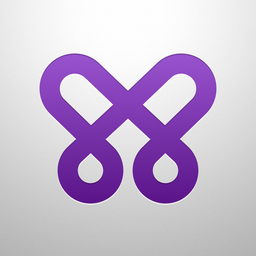</a></td>
        </tr>
    </tbody>
</table>

### Diigo

<table>
    <thead>
        <tr>
            <th><a href="https://en.wikipedia.org/wiki/Diigo">Diigo</a> <a href="#note"><code>*</code></a></th>
            <th><a href="https://en.wikipedia.org/wiki/Diigo">Diigo</a> <a href="#note"><code>*</code></a></th>
            <th><a href="https://en.wikipedia.org/wiki/Diigo">Diigo</a> <a href="#note"><code>*</code></a></th>
        </tr>
    </thead>
    <tbody>
        <tr height=160>
            <td></td>
            <td></td>
            <td></td>
        </tr>
    </tbody>
</table>

### Docler

<table>
    <thead>
        <tr>
            <th><a href="https://web.archive.org/web/20150801111856/http://doclerbrowser.com/">Docler</a> <a href="#note"><code>*</code></a></th>
        </tr>
    </thead>
    <tbody>
        <tr height=160>
            <td></td>
        </tr>
    </tbody>
</table>

### Dolphin

<table>
    <thead>
        <tr>
            <th><a href="https://en.wikipedia.org/wiki/Dolphin_Browser">Dolphin</a> <a href="#note"><code>*</code></a></th>
            <th><a href="https://en.wikipedia.org/wiki/Dolphin_Browser">Dolphin</a> <a href="#note"><code>*</code></a></th>
        </tr>
    </thead>
    <tbody>
        <tr height=160>
            <td></td>
            <td></td>
        </tr>
    </tbody>
</table>

### Dolphin Beta

<table>
    <thead>
        <tr>
            <th><a href="https://en.wikipedia.org/wiki/Dolphin_Browser">Dolphin Beta</a></th>
        </tr>
    </thead>
    <tbody>
        <tr height=160>
            <td></td>
        </tr>
    </tbody>
</table>

### Dolphin Zero

<table>
    <thead>
        <tr>
            <th><a href="https://en.wikipedia.org/wiki/Dolphin_Browser">Dolphin Zero</a></th>
        </tr>
    </thead>
    <tbody>
        <tr height=160>
            <td></td>
        </tr>
    </tbody>
</table>

### Endless

<table>
    <thead>
        <tr>
            <th><a href="https://github.com/jcs/endless">Endless</a></th>
        </tr>
    </thead>
    <tbody>
        <tr height=160>
            <td><a href="endless">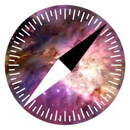</a></td>
        </tr>
    </tbody>
</table>

### Epic

<table>
    <thead>
        <tr>
            <th><a href="https://en.wikipedia.org/wiki/Epic_%28web_browser%29">Epic</a> <a href="#note"><code>*</code></a></th>
        </tr>
    </thead>
    <tbody>
        <tr height=160>
            <td></td>
        </tr>
    </tbody>
</table>

### Epiphany

<table>
    <thead>
        <tr>
            <th><a href="https://en.wikipedia.org/wiki/Web_%28web_browser%29">Epiphany</a></th>
        </tr>
    </thead>
    <tbody>
        <tr height=160>
            <td></td>
        </tr>
    </tbody>
</table>

### Exsoul

<table>
    <thead>
        <tr>
            <th><a href="https://web.archive.org/web/20150803013210/http://www.exsoul-browser.com/">Exsoul</a> <a href="#note"><code>*</code></a></th>
            <th><a href="https://web.archive.org/web/20150803013210/http://www.exsoul-browser.com/">Exsoul</a> <a href="#note"><code>*</code></a></th>
        </tr>
    </thead>
    <tbody>
        <tr height=160>
            <td></td>
            <td></td>
        </tr>
    </tbody>
</table>

### Fake

<table>
    <thead>
        <tr>
            <th><a href="https://web.archive.org/web/20150801071338/http://fakeapp.com/">Fake</a></th>
        </tr>
    </thead>
    <tbody>
        <tr height=160>
            <td></td>
        </tr>
    </tbody>
</table>

### Fennec

<table>
    <thead>
        <tr>
            <th><a href="https://en.wikipedia.org/wiki/Firefox_for_mobile">Fennec</a></th>
        </tr>
    </thead>
    <tbody>
        <tr height=160>
            <td></td>
        </tr>
    </tbody>
</table>

### Firefox

<table>
    <thead>
        <tr>
            <th><a href="https://en.wikipedia.org/wiki/Firefox#History">Phoenix / Firebird</a></th>
            <th><a href="https://en.wikipedia.org/wiki/Firefox">Firefox 1</a></th>
            <th><a href="https://en.wikipedia.org/wiki/Firefox">Firefox 1.5-3</a></th>
            <th><a href="https://en.wikipedia.org/wiki/Firefox">Firefox 3.5-22</a></th>
        </tr>
    </thead>
    <tbody>
        <tr height=160>
            <td></td>
            <td></td>
            <td></td>
            <td></td>
        </tr>
    </tbody>
</table>

### Firefox Aurora

<table>
    <thead>
        <tr>
            <th><a href="https://en.wikipedia.org/wiki/Firefox#Versions">Firefox Aurora 5-22</a></th>
            <th><a href="https://en.wikipedia.org/wiki/Firefox#Versions">Firefox Aurora 23-35</a></th>
        </tr>
    </thead>
    <tbody>
        <tr height=160>
            <td></td>
            <td></td>
        </tr>
    </tbody>
</table>

### Firefox Nightly

<table>
    <thead>
        <tr>
            <th><a href="https://en.wikipedia.org/wiki/Firefox#Versions">Firefox Nightly 6-22</a></th>
        </tr>
    </thead>
    <tbody>
        <tr height=160>
            <td></td>
        </tr>
    </tbody>
</table>

### Flock

<table>
    <thead>
        <tr>
            <th><a href="https://en.wikipedia.org/wiki/Flock_%28web_browser%29">Flock</a></th>
        </tr>
    </thead>
    <tbody>
        <tr height=160>
            <td></td>
        </tr>
    </tbody>
</table>

### GreenBrowser

<table>
    <thead>
        <tr>
            <th><a href="https://en.wikipedia.org/wiki/GreenBrowser">GreenBrowser</a></th>
        </tr>
    </thead>
    <tbody>
        <tr height=160>
            <td></td>
        </tr>
    </tbody>
</table>

### iCab (Mobile)

<table>
    <thead>
        <tr>
            <th><a href="https://en.wikipedia.org/wiki/ICab">iCab (Mobile)</a> <a href="#note"><code>*</code></a></th>
        </tr>
    </thead>
    <tbody>
        <tr height=160>
            <td></td>
        </tr>
    </tbody>
</table>

### Iceape

<table>
    <thead>
        <tr>
            <th><a href="https://en.wikipedia.org/wiki/Mozilla_Corporation_software_rebranded_by_the_Debian_project#Iceape">Iceape</a></th>
        </tr>
    </thead>
    <tbody>
        <tr height=160>
            <td></td>
        </tr>
    </tbody>
</table>

### iLunascape

<table>
    <thead>
        <tr>
            <th><a href="https://en.wikipedia.org/wiki/Lunascape">iLunascape  (Android)</a> <a href="#note"><code>*</code></a></th>
            <th><a href="https://en.wikipedia.org/wiki/Lunascape">iLunascape  (iOS)</a> <a href="#note"><code>*</code></a></th>
        </tr>
    </thead>
    <tbody>
        <tr height=160>
            <td></td>
            <td></td>
        </tr>
    </tbody>
</table>

### Internet Explorer

<table>
    <thead>
        <tr>
            <th>Internet Explorer <a href="https://en.wikipedia.org/wiki/Internet_Explorer_6">6</a></th>
            <th>Internet Explorer <a href="https://en.wikipedia.org/wiki/Internet_Explorer_7">7</a> / <a href="https://en.wikipedia.org/wiki/Internet_Explorer_8">8</a></th>
            <th>Internet Explorer <a href="https://en.wikipedia.org/wiki/Internet_Explorer_9">9</a> / <a href="https://en.wikipedia.org/wiki/Internet_Explorer_10">10</a> / <a href="https://en.wikipedia.org/wiki/Internet_Explorer_11">11</a></th>
            <th>Internet Explorer <a href="https://en.wikipedia.org/wiki/Internet_Explorer_10">10</a> / <a href="https://en.wikipedia.org/wiki/Internet_Explorer_11">11</a> tile</th>
        </tr>
    </thead>
    <tbody>
        <tr height=160>
            <td></td>
            <td></td>
            <td></td>
            <td></td>
        </tr>
    </tbody>
</table>

### Internet Explorer Developer Channel

<table>
    <thead>
        <tr>
            <th><a href="https://web.archive.org/web/20150906060618/http://blogs.msdn.com/b/ie/archive/2014/06/16/announcing-internet-explorer-developer-channel.aspx">Internet Explorer  Developer Channel</a></th>
        </tr>
    </thead>
    <tbody>
        <tr height=160>
            <td></td>
        </tr>
    </tbody>
</table>

### K-Meleon

<table>
    <thead>
        <tr>
            <th><a href="https://en.wikipedia.org/wiki/K-Meleon">K-Meleon</a></th>
        </tr>
    </thead>
    <tbody>
        <tr height=160>
            <td></td>
        </tr>
    </tbody>
</table>

### K9

<table>
    <thead>
        <tr>
            <th><a href="https://en.wikipedia.org/wiki/K9_Web_Protection">K9</a></th>
        </tr>
    </thead>
    <tbody>
        <tr height=160>
            <td></td>
        </tr>
    </tbody>
</table>

### KidZui

<table>
    <thead>
        <tr>
            <th><a href="https://en.wikipedia.org/wiki/KidZui">KidZui</a></th>
        </tr>
    </thead>
    <tbody>
        <tr height=160>
            <td></td>
        </tr>
    </tbody>
</table>

### Konqueror

<table>
    <thead>
        <tr>
            <th><a href="https://en.wikipedia.org/wiki/Konqueror">Konqueror 1-3</a></th>
            <th><a href="https://en.wikipedia.org/wiki/Konqueror">Konqueror 4</a></th>
        </tr>
    </thead>
    <tbody>
        <tr height=160>
            <td></td>
            <td></td>
        </tr>
    </tbody>
</table>

### Kylo

<table>
    <thead>
        <tr>
            <th><a href="https://en.wikipedia.org/wiki/Kylo_%28web_browser%29">Kylo</a></th>
        </tr>
    </thead>
    <tbody>
        <tr height=160>
            <td></td>
        </tr>
    </tbody>
</table>

### Lightning

<table>
    <thead>
        <tr>
            <th><a href="https://github.com/anthonycr/Lightning-Browser/">Lightning</a> <a href="#note"><code>*</code></a></th>
        </tr>
    </thead>
    <tbody>
        <tr height=160>
            <td><a href="lightning">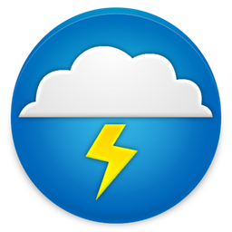</a></td>
        </tr>
    </tbody>
</table>

### Link Bubble

<table>
    <thead>
        <tr>
            <th><a href="https://web.archive.org/web/20150320102407/http://www.linkbubble.com/">Link Bubble 1-1.4</a></th>
            <th><a href="https://web.archive.org/web/20150320102407/http://www.linkbubble.com/">Link Bubble 1.5-1.7</a></th>
        </tr>
    </thead>
    <tbody>
        <tr height=160>
            <td></td>
            <td></td>
        </tr>
    </tbody>
</table>

### Links

<table>
    <thead>
        <tr>
            <th><a href="https://en.wikipedia.org/wiki/Links_%28web_browser%29">Links</a></th>
        </tr>
    </thead>
    <tbody>
        <tr height=160>
            <td></td>
        </tr>
    </tbody>
</table>

### Liri

<table>
    <thead>
        <tr>
            <th><a href="https://github.com/liri-project/liri-browser#readme">Liri</a></th>
        </tr>
    </thead>
    <tbody>
        <tr height=160>
            <td></td>
        </tr>
    </tbody>
</table>

### Maxthon

<table>
    <thead>
        <tr>
            <th><a href="https://en.wikipedia.org/wiki/Maxthon">Maxthon</a> <a href="#note"><code>*</code></a></th>
        </tr>
    </thead>
    <tbody>
        <tr height=160>
            <td></td>
        </tr>
    </tbody>
</table>

### Maxthon Beta

<table>
    <thead>
        <tr>
            <th><a href="https://en.wikipedia.org/wiki/Maxthon">Maxthon Beta</a> <a href="#note"><code>*</code></a></th>
        </tr>
    </thead>
    <tbody>
        <tr height=160>
            <td></td>
        </tr>
    </tbody>
</table>

### Mercury

<table>
    <thead>
        <tr>
            <th><a href="https://en.wikipedia.org/wiki/Mercury_Browser">Mercury</a> <a href="#note"><code>*</code></a></th>
            <th><a href="https://en.wikipedia.org/wiki/Mercury_Browser">Mercury</a> <a href="#note"><code>*</code></a></th>
        </tr>
    </thead>
    <tbody>
        <tr height=160>
            <td></td>
            <td></td>
        </tr>
    </tbody>
</table>

### Midori

<table>
    <thead>
        <tr>
            <th><a href="https://en.wikipedia.org/wiki/Midori_%28web_browser%29">Midori</a></th>
        </tr>
    </thead>
    <tbody>
        <tr height=160>
            <td></td>
        </tr>
    </tbody>
</table>

### MetaCert

<table>
    <thead>
        <tr>
            <th><a href="https://web.archive.org/web/20150624200845/https://metacert.com/">MetaCert</a> <a href="#note"><code>*</code></a></th>
        </tr>
    </thead>
    <tbody>
        <tr height=160>
            <td></td>
        </tr>
    </tbody>
</table>

### Mobicip

<table>
    <thead>
        <tr>
            <th><a href="https://en.wikipedia.org/wiki/Mobicip">Mobicip</a> <a href="#note"><code>*</code></a></th>
            <th><a href="https://en.wikipedia.org/wiki/Mobicip">Mobicip</a> <a href="#note"><code>*</code></a></th>
        </tr>
    </thead>
    <tbody>
        <tr height=160>
            <td></td>
            <td></td>
        </tr>
    </tbody>
</table>

### Mosaic

<table>
    <thead>
        <tr>
            <th><a href="https://en.wikipedia.org/wiki/Mosaic_%28web_browser%29">Mosaic</a></th>
        </tr>
    </thead>
    <tbody>
        <tr height=160>
            <td></td>
        </tr>
    </tbody>
</table>

### Moznet Fire

<table>
    <thead>
        <tr>
            <th><a href="https://web.archive.org/web/20141023171026/http://www.moznet.bplaced.net/">Moznet Fire</a></th>
        </tr>
    </thead>
    <tbody>
        <tr height=160>
            <td></td>
        </tr>
    </tbody>
</table>

### Netscape

<table>
    <thead>
        <tr>
            <th><a href="https://en.wikipedia.org/wiki/Netscape_%28web_browser%29">Netscape 4-6</a></th>
            <th><a href="https://en.wikipedia.org/wiki/Netscape_Browser">Netscape 8</a></th>
            <th><a href="https://en.wikipedia.org/wiki/Netscape_Navigator_9">Netscape 9</a></th>
        </tr>
    </thead>
    <tbody>
        <tr height=160>
            <td></td>
            <td></td>
            <td></td>
        </tr>
    </tbody>
</table>

### Next

<table>
    <thead>
        <tr>
            <th><a href="https://web.archive.org/web/20141116131240/http://nextbrowser.goforandroid.com/">Next</a></th>
        </tr>
    </thead>
    <tbody>
        <tr height=160>
            <td></td>
        </tr>
    </tbody>
</table>

### Ninesky

<table>
    <thead>
        <tr>
            <th><a href="https://web.archive.org/web/20140102181923/http://ninesky.com/">Ninesky</a> <a href="#note"><code>*</code></a></th>
        </tr>
    </thead>
    <tbody>
        <tr height=160>
            <td></td>
        </tr>
    </tbody>
</table>

### OmniWeb

<table>
    <thead>
        <tr>
            <th><a href="https://en.wikipedia.org/wiki/OmniWeb">OmniWeb 1-5</a></th>
            <th><a href="https://en.wikipedia.org/wiki/OmniWeb">OmniWeb 6</a></th>
        </tr>
    </thead>
    <tbody>
        <tr height=160>
            <td></td>
            <td></td>
        </tr>
    </tbody>
</table>

### NLIA

<table>
    <thead>
        <tr>
            <th><a href="https://web.archive.org/web/20150411053800/http://e.netpia.com/">NLIA</a></th>
        </tr>
    </thead>
    <tbody>
        <tr height=160>
            <td></td>
        </tr>
    </tbody>
</table>

### ONE

<table>
    <thead>
        <tr>
            <th><a href="https://web.archive.org/web/20140406142259/http://one-browser.com/mobile/home/">ONE (Android)</a> <a href="#note"><code>*</code></a></th>
            <th><a href="https://web.archive.org/web/20140406142259/http://one-browser.com/mobile/home/">ONE (iOS)</a> <a href="#note"><code>*</code></a></th>
        </tr>
    </thead>
    <tbody>
        <tr height=160>
            <td><a href="one-android">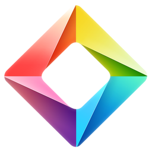</a></td>
            <td><a href="one-ios">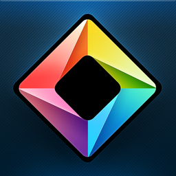</a></td>
        </tr>
    </tbody>
</table>

### Opera

<table>
    <thead>
        <tr>
            <th><a href="https://en.wikipedia.org/wiki/Opera_%28web_browser%29">Opera 2-6</a></th>
            <th><a href="https://en.wikipedia.org/wiki/Opera_%28web_browser%29">Opera 7-9</a></th>
            <th><a href="https://en.wikipedia.org/wiki/Opera_%28web_browser%29">Opera 10-14</a></th>
            <th><a href="https://en.wikipedia.org/wiki/Opera_%28web_browser%29">Opera 15-32</a></th>
        </tr>
    </thead>
    <tbody>
        <tr height=160>
            <td></td>
            <td></td>
            <td></td>
            <td></td>
        </tr>
    </tbody>
</table>

### Opera Beta

<table>
    <thead>
        <tr>
            <th><a href="https://en.wikipedia.org/wiki/Opera_%28web_browser%29#Opera_Developer_and_Opera_Nex">Opera Next 15-24</a></th>
            <th><a href="https://en.wikipedia.org/wiki/Opera_%28web_browser%29#Opera_Developer_and_Opera_Next">Opera Beta 25-32</a></th>
        </tr>
    </thead>
    <tbody>
        <tr height=160>
            <td><a href="opera-next_15-24">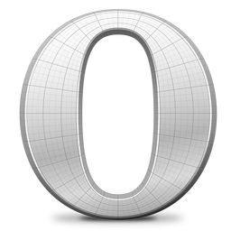</a></td>
            <td></td>
        </tr>
    </tbody>
</table>

### Opera Developer

<table>
    <thead>
        <tr>
            <th><a href="https://en.wikipedia.org/wiki/Opera_%28web_browser%29#Opera_Developer_and_Opera_Nex">Opera Developer 16-33</a></th>
        </tr>
    </thead>
    <tbody>
        <tr height=160>
            <td><a href="opera-developer_16-33">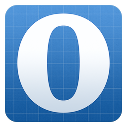</a></td>
        </tr>
    </tbody>
</table>

### Opera Mini

<table>
    <thead>
        <tr>
            <th><a href="https://en.wikipedia.org/wiki/Opera_Mini">Opera Mini</a> <a href="#note"><code>*</code></a></th>
            <th><a href="https://en.wikipedia.org/wiki/Opera_Mini">Opera Mini</a> <a href="#note"><code>*</code></a></th>
        </tr>
    </thead>
    <tbody>
        <tr height=160>
            <td></td>
            <td></td>
        </tr>
    </tbody>
</table>

### Opera Mini Beta

<table>
    <thead>
        <tr>
            <th><a href="https://en.wikipedia.org/wiki/Opera_Mini">Opera Mini Beta</a> <a href="#note"><code>*</code></a></th>
        </tr>
    </thead>
    <tbody>
        <tr height=160>
            <td></td>
        </tr>
    </tbody>
</table>

### Orca

<table>
    <thead>
        <tr>
            <th><a href="https://en.wikipedia.org/wiki/Avant_Browser#History_and_development">Orca</a></th>
        </tr>
    </thead>
    <tbody>
        <tr height=160>
            <td></td>
        </tr>
    </tbody>
</table>

### Orweb

<table>
    <thead>
        <tr>
            <th><a href="https://web.archive.org/web/20150802023241/https://guardianproject.info/apps/orweb/">Orweb</a></th>
        </tr>
    </thead>
    <tbody>
        <tr height=160>
            <td></td>
        </tr>
    </tbody>
</table>

### Photon

<table>
    <thead>
        <tr>
            <th><a href="https://web.archive.org/web/20150629011134/http://www.appsverse.com/Index">Photon</a></th>
        </tr>
    </thead>
    <tbody>
        <tr height=160>
            <td></td>
        </tr>
    </tbody>
</table>

### Puffin

<table>
    <thead>
        <tr>
            <th><a href="https://web.archive.org/web/20160804095610/https://www.puffinbrowser.com/index.php">Puffin</a> <a href="#note"><code>*</code></a></th>
            </th>
        </tr>
    </thead>
    <tbody>
        <tr height=160>
            <td></td>
        </tr>
    </tbody>
</table>

### QQ

<table>
    <thead>
        <tr>
            <th><a href="https://web.archive.org/web/20160115132857/http://browser.qq.com/">QQ</a> <a href="#note"><code>*</code></a></th>
            <th><a href="https://web.archive.org/web/20160115132857/http://browser.qq.com/">QQ</a> <a href="#note"><code>*</code></a></th>
        </tr>
    </thead>
    <tbody>
        <tr height=160>
            <td></td>
            <td><a href="qq_2">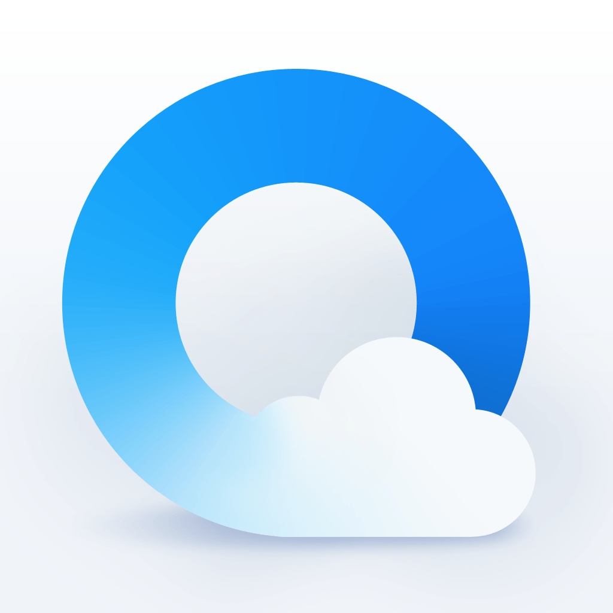</a></td>
        </tr>
    </tbody>
</table>

### rekonq

<table>
    <thead>
        <tr>
            <th><a href="https://en.wikipedia.org/wiki/Rekonq">rekonq</a></th>
        </tr>
    </thead>
    <tbody>
        <tr height=160>
            <td></td>
        </tr>
    </tbody>
</table>

### Roccat

<table>
    <thead>
        <tr>
            <th><a href="https://web.archive.org/web/20160708015650/http://runecats.com/">Roccat</a></th>
        </tr>
    </thead>
    <tbody>
        <tr height=160>
            <td></td>
        </tr>
    </tbody>
</table>

### Rockmelt

<table>
    <thead>
        <tr>
            <th><a href="https://en.wikipedia.org/wiki/Rockmelt">Rockmelt</a></th>
            <th><a href="https://en.wikipedia.org/wiki/Rockmelt">Rockmelt (iOS)</a></th>
        </tr>
    </thead>
    <tbody>
        <tr height=160>
            <td></td>
            <td></td>
        </tr>
    </tbody>
</table>

### Safari

<table>
    <thead>
        <tr>
            <th><a href="https://en.wikipedia.org/wiki/Safari_%28web_browser%29">Safari 1-7</a></th>
        </tr>
    </thead>
    <tbody>
        <tr height=160>
            <td></td>
        </tr>
    </tbody>
</table>

### Safari (iOS)

<table>
    <thead>
        <tr>
            <th><a href="https://en.wikipedia.org/wiki/Safari_%28web_browser%29">Safari (iOS) 1-6 </a></th>
        </tr>
    </thead>
    <tbody>
        <tr height=160>
            <td></td>
        </tr>
    </tbody>
</table>

### Shiira

<table>
    <thead>
        <tr>
            <th><a href="https://en.wikipedia.org/wiki/Shiira">Shiira</a></th>
        </tr>
    </thead>
    <tbody>
        <tr height=160>
            <td></td>
        </tr>
    </tbody>
</table>

### Silk

<table>
    <thead>
        <tr>
            <th><a href="https://en.wikipedia.org/wiki/Amazon_Silk">Silk</a> <a href="#note"><code>*</code></a></th>
        </tr>
    </thead>
    <tbody>
        <tr height=160>
            <td></td>
        </tr>
    </tbody>
</table>

### Skyfire

<table>
    <thead>
        <tr>
            <th><a href="https://en.wikipedia.org/wiki/Skyfire_%28company%29#Skyfire_Web_Browser">Skyfire (Android)</a> <a href="#note"><code>*</code></a></th>
            <th><a href="https://en.wikipedia.org/wiki/Skyfire_%28company%29#Skyfire_Web_Browser">Skyfire (iOS)</a> <a href="#note"><code>*</code></a></th>
        </tr>
    </thead>
    <tbody>
        <tr height=160>
            <td></td>
            <td></td>
        </tr>
    </tbody>
</table>

### Sleipnir (Mobile)

<table>
    <thead>
        <tr>
            <th><a href="https://en.wikipedia.org/wiki/Sleipnir_%28web_browser%29">Sleipnir (Mobile)</a> <a href="#note"><code>*</code></a></th>
        </tr>
    </thead>
    <tbody>
        <tr height=160>
            <td></td>
        </tr>
    </tbody>
</table>

### SlimBoat

<table>
    <thead>
        <tr>
            <th><a href="https://en.wikipedia.org/wiki/SlimBrowser">SlimBoat</a></th>
        </tr>
    </thead>
    <tbody>
        <tr height=160>
            <td></td>
        </tr>
    </tbody>
</table>

### Sogou (Mobile)

<table>
    <thead>
        <tr>
            <th><a href="https://en.wikipedia.org/wiki/Sogou#Sogou_browser">Sogou (Mobile)</a> <a href="#note"><code>*</code></a></th>
            <th><a href="https://en.wikipedia.org/wiki/Sogou#Sogou_browser">Sogou (Mobile)</a> <a href="#note"><code>*</code></a></th>
        </tr>
    </thead>
    <tbody>
        <tr height=160>
            <td></td>
            <td></td>
        </tr>
    </tbody>
</table>

### SRWare Iron

<table>
    <thead>
        <tr>
            <th><a href="https://en.wikipedia.org/wiki/SRWare_Iron">SRWare Iron</a></th>
        </tr>
    </thead>
    <tbody>
        <tr height=160>
            <td></td>
        </tr>
    </tbody>
</table>

### Stainless

<table>
    <thead>
        <tr>
            <th><a href="https://github.com/mesadynamics/stainless">Stainless</a></th>
        </tr>
    </thead>
    <tbody>
        <tr height=160>
            <td><a href="stainless">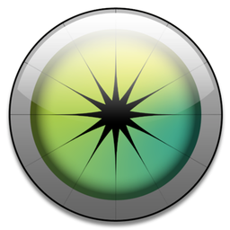</a></td>
        </tr>
    </tbody>
</table>

### Super Fast

<table>
    <thead>
        <tr>
            <th><a href="https://web.archive.org/web/20150423215607/http://www.sfbrowser.com/">Super Fast</a></th>
        </tr>
    </thead>
    <tbody>
        <tr height=160>
            <td></td>
        </tr>
    </tbody>
</table>

### surf

<table>
    <thead>
        <tr>
            <th><a href="https://en.wikipedia.org/wiki/Surf_%28web_browser%29">surf</a></th>
        </tr>
    </thead>
    <tbody>
        <tr height=160>
            <td></td>
        </tr>
    </tbody>
</table>

### Swiftfox

<table>
    <thead>
        <tr>
            <th><a href="https://en.wikipedia.org/wiki/Swiftfox">Swiftfox</a></th>
        </tr>
    </thead>
    <tbody>
        <tr height=160>
            <td></td>
        </tr>
    </tbody>
</table>

### Torch

<table>
    <thead>
        <tr>
            <th><a href="https://en.wikipedia.org/wiki/Torch_%28browser%29">Torch</a></th>
        </tr>
    </thead>
    <tbody>
        <tr height=160>
            <td></td>
        </tr>
    </tbody>
</table>

### UC

<table>
    <thead>
        <tr>
            <th><a href="https://en.wikipedia.org/wiki/UC_Browser">UC</a> <a href="#note"><code>*</code></a></th>
        </tr>
    </thead>
    <tbody>
        <tr height=160>
            <td></td>
        </tr>
    </tbody>
</table>

### Uzbl

<table>
    <thead>
        <tr>
            <th><a href="https://en.wikipedia.org/wiki/Uzbl">Uzbl</a></th>
        </tr>
    </thead>
    <tbody>
        <tr height=160>
            <td></td>
        </tr>
    </tbody>
</table>

### Vitrum

<table>
    <thead>
        <tr>
            <th><a href="https://web.archive.org/web/20140928181625/https://itunes.apple.com/us/app/vitrum-unique-web-browser/id569847799?mt=8">Vitrum</a></th>
        </tr>
    </thead>
    <tbody>
        <tr height=160>
            <td></td>
        </tr>
    </tbody>
</table>

### WaterFox

<table>
    <thead>
        <tr>
            <th><a href="https://en.wikipedia.org/wiki/Waterfox">WaterFox</a> <a href="#note"><code>*</code></a></th>
        </tr>
    </thead>
    <tbody>
        <tr height=160>
            <td><a href="waterfox">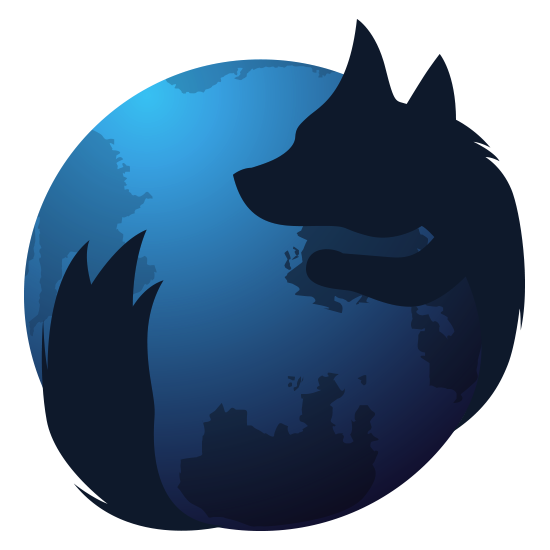</a></td>
        </tr>
    </tbody>
</table>

### WebKit Nightly

<table>
    <thead>
        <tr>
            <th><a href="https://en.wikipedia.org/wiki/WebKit">WebKit Nightly 1-7</a></th>
            <th><a href="https://en.wikipedia.org/wiki/WebKit">WebKit Nightly 8-9</a></th>
        </tr>
    </thead>
    <tbody>
        <tr height=160>
            <td></td>
            <td></td>
        </tr>
    </tbody>
</table>

### WebPositive

<table>
    <thead>
        <tr>
            <th><a href="https://en.wikipedia.org/wiki/WebPositive">WebPositive</a></th>
        </tr>
    </thead>
    <tbody>
        <tr height=160>
            <td></td>
        </tr>
    </tbody>
</table>

### Wyzo

<table>
    <thead>
        <tr>
            <th><a href="https://en.wikipedia.org/wiki/Wyzo">Wyzo</a></th>
        </tr>
    </thead>
    <tbody>
        <tr height=160>
            <td></td>
        </tr>
    </tbody>
</table>

### Xombrero

<table>
    <thead>
        <tr>
            <th><a href="https://en.wikipedia.org/wiki/Xombrero">Xombrero</a></th>
        </tr>
    </thead>
    <tbody>
        <tr height=160>
            <td></td>
        </tr>
    </tbody>
</table>

### Xpress

<table>
    <thead>
        <tr>
            <th><a href="https://en.wikipedia.org/wiki/Nokia_Xpress">Xpress</a> <a href="#note"><code>*</code></a></th>
        </tr>
    </thead>
    <tbody>
        <tr height=160>
            <td></td>
        </tr>
    </tbody>
</table>

### Xtravo

<table>
    <thead>
        <tr>
            <th><a href="https://github.com/sheikhimran01/xtravo">Xtravo</a></th>
        </tr>
    </thead>
    <tbody>
        <tr height=160>
            <td></td>
        </tr>
    </tbody>
</table>

### Yandex

<table>
    <thead>
        <tr>
            <th><a href="https://en.wikipedia.org/wiki/Yandex_Browser">Yandex</a> <a href="#note"><code>*</code></a></th>
        </tr>
    </thead>
    <tbody>
        <tr height=160>
            <td></td>
        </tr>
    </tbody>
</table>

--

### Note:

__`*`__ indicates that the exact browser version is unknown.
