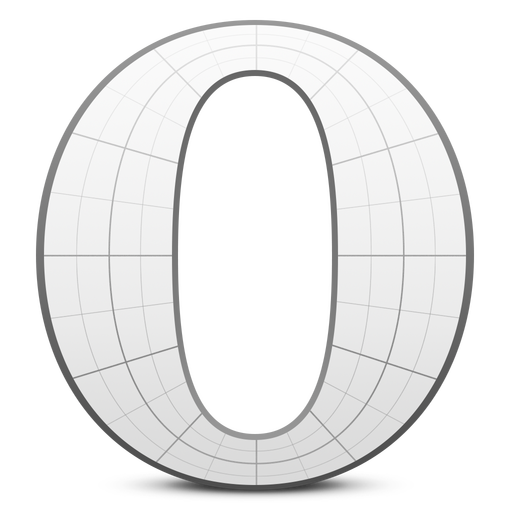

# Opera Beta v25-32

<table>
    <tbody>
        <tr>
            <td height="512px" width="512px">
                
            </td>
        <tr>
    </tbody>
</table>

## How to get this logo

* Install with:

  * [`npm`](https://www.npmjs.com/): `npm install --save-dev @browser-logos/opera-beta_25-32`
  * [`Yarn`](https://yarnpkg.com/): `yarn add --dev @browser-logos/opera-beta_25-32`

* Use [`cdnjs`](https://cdnjs.com/libraries/browser-logos)
